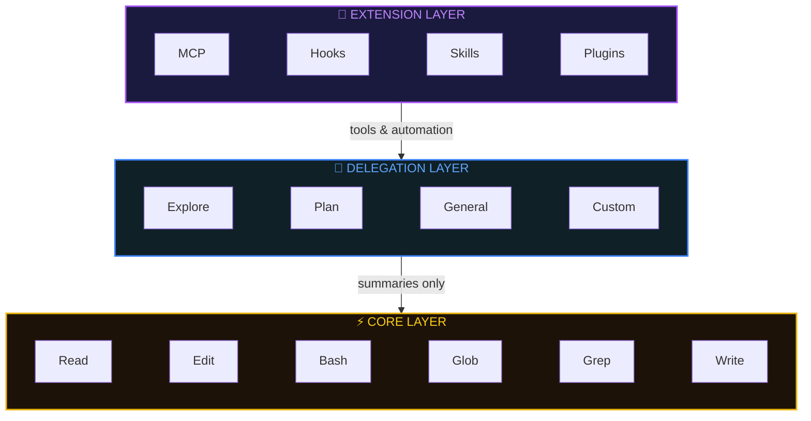
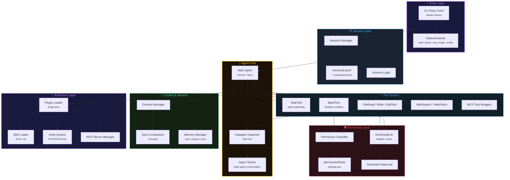
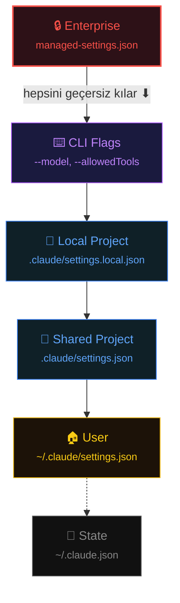

# Agentic System: Claude Code

Claude Code, programlama bilgisi olan bir sohbet arayüzü değil, bir **agentic system**'dir. CLI üzerinden codebase'inizi okur, komut çalıştırır, dosya düzenler, git workflow'larını yönetir, MCP ile dış servislere bağlanır ve karmaşık görevleri özelleşmiş subagent'lara devreder. Her şey, geliştiricilerin gerçek çalışma biçimine entegre olan bir command-line interface üzerinden akar.

Sıradan ve etkili Claude Code kullanımı arasındaki fark beş temel sisteme dayanır:

* **Configuration hierarchy**: davranışı kontrol eder
* **Permission system**: operasyonları yetkilendirir
* **Hook system**: deterministik otomasyon sağlar
* **MCP protocol**: yetenekleri genişletir
* **Subagent system**: çok adımlı karmaşık görevleri yönetir

### Key Takeaways

> Bu rehberde kişisel tercihlerimi, günlük kullanımda verim aldığım yaklaşımları ve deneyimlerimi paylaşıyorum. Claude Code hakkında İngilizce kaynak bolca mevcut; ancak kişisel deneyimin dokümantasyondan çok daha değerli olduğuna inanıyorum. Bu yüzden bu seriyi hazırlamaya karar verdim.

* Beş sistem etkinliğinizi belirler: configuration hierarchy, permissions, hooks, MCP ve subagents — davranıştan otomasyona her şeyi kontrol eder.

* İşleri Delegation Layer'a itin: subagent'lar temiz context window'larda çalışarak context bloat'u önler, sadece özetleri döndürür.

* Hook'lar çalışmayı garanti eder; prompt'lar garanti etmez: linting, formatting ve güvenlik kontrolleri gibi her seferinde çalışması gereken işler için hook kullanın.

* Model katmanlama maliyeti düşürür: subagent keşiflerini ucuz modellere yönlendirin, Opus'u mimari kararlar için saklayın — ya da kalite tek değişkeninizse Opus'ta standartlaşın.

* MCP, Claude'u araç zincirinize bağlar: veritabanları, GitHub, Sentry ve 3.000+ entegrasyon, Claude'u dosya okuma ve bash komutlarının ötesine taşır.

# How Claude Code Works: The Mental Model

Özelliklere geçmeden önce, Claude Code'un mimarisini anlayın. Önce büyük resim, sonra detay.

## Three-Layer Mental Model

Sistem üç katmanda çalışır:



**Core Layer**: Ana konuşma alanınız. Her mesaj, dosya okuma ve tool çıktısı, paylaşılan bir context window'dan token tüketir (standart 200K, Opus 4.6 veya extended context modelleriyle 1M). Context dolduğunda Claude önceki kararları kaybeder ve kalite düşer. Bu katman token başına maliyet oluşturur.

**Delegation Layer**: Subagent'lar temiz context'lerle başlar, odaklanmış iş yapar ve sadece özetleri döndürür. Keşif sonuçları ana konuşmanızı şişirmez; yalnızca sonuçlar geri gelir. Keşif için subagent'ları ucuz model seviyelerine yönlendirin veya kalite maliyetten önemliyse birincil modelinizi kullanın.

**Extension Layer**: MCP dış servisleri bağlar (veritabanları, GitHub, Sentry). Hook'lar, model davranışından bağımsız olarak shell komutlarının çalışmasını garanti eder. Skill'ler, Claude'un otomatik uyguladığı alan uzmanlığını kodlar. Plugin'ler tüm bunları dağıtım için paketler.

**Key Insight**: Çoğu kullanıcı tamamen Core Layer'da çalışır, context bloat ve maliyetlerin tırmandığını izler. İleri düzey kullanıcılar keşif ve özelleşmiş işleri Delegation Layer'a iter, Extension Layer'ı workflow'ları için yapılandırır ve Core Layer'ı yalnızca orkestrasyon ve nihai kararlar için kullanır.

## System Components & Data Flow

Katmanların iç bileşenleri ve aralarındaki veri akışı:



> **Kaynak:** [DeepWiki — Claude Code System Architecture](https://deepwiki.com/anthropics/claude-code/1.1-system-architecture)

### Entry Point and CLI Layer

Birincil giriş noktası `claude` komutudur. Argument parsing, environment variable işleme (ör. `CLAUDE_CODE_DISABLE_TERMINAL_TITLE`) ve subcommand'lara ya da interaktif agent session'a yönlendirme işlemlerini üstlenir.

### Session Management

Session'lar konuşma geçmişini ve metadata'yı saklar. Her session `~/.claude/sessions/<session-id>/` altında tutulur.

- **Transcript Persistence**: Geçmiş `transcript.jsonl` dosyasına kaydedilir. Büyük session'lar (>5 MB) geliştirilmiş bellek verimliliğiyle yönetilir.
- **Resumption**: `/resume` komutu session'lar arasında geçiş sağlar; mevcut session için `SessionEnd` hook'u, yeni session için `SessionStart` hook'u tetiklenir.
- **Remote Control**: `/remote-control` komutu, yerel session'ları `claude.ai/code` üzerinden tarayıcı veya telefon erişimine köprüler.

### Agent Orchestration

Claude Code, bir "Main Agent"ın özelleşmiş işleri "Subagent"lara devredebildiği multi-agent mimari kullanır.

**Subagents and the Task Tool**

Task tool, modelin belirli hedefler için subagent başlatmasını sağlar.

- **Worktree Isolation**: Subagent'lar, ana çalışma dizinini kirletmemek için geçici git worktree'lerde başlatılabilir.
- **Backgrounding**: Uzun süren görevler arka plana alınabilir; kullanıcı ana agent ile etkileşime devam eder.
- **Parallelism**: Multi-agent team'ler (ör. code-review plugin) farklı modellerle (Sonnet/Opus) paralel reviewer çalıştırır ve son bir doğrulama adımı uygular.

### Tool System & Permissions

Tool'lar, agent'ların dosya sistemi ve shell ile etkileşim kurmasının birincil yoludur.

#### Tool Execution Flow

```mermaid
graph LR
    AGENT["🧠 Agent"] -- "tool çağrısı" --> ENGINE["Execution Engine"]
    ENGINE -- "kural kontrolü" --> PERM{"Permission<br/>Classifier"}
    PERM -- "allow ✅" --> EXEC["Execute"]
    PERM -- "no match ❓" --> ASK["Kullanıcıya Sor"]
    PERM -- "deny 🚫" --> ERR["Return Error"]
    ASK -- "onaylandı" --> EXEC
    ASK -- "reddedildi" --> ERR

    subgraph TOOLS["Available Tools"]
        BashTool["BashTool"]
        FileReadTool["FileReadTool"]
        FileWriteTool["FileWriteTool"]
        WebTools["WebSearch / WebFetch"]
        MCPTool["MCP Tools"]
    end

    EXEC --> TOOLS
    TOOLS -- "sonuç" --> AGENT

    style AGENT fill:#1c1208,stroke:#eab308,stroke-width:2px,color:#facc15
    style ENGINE fill:#1a1a3e,stroke:#a855f7,stroke-width:1px,color:#c084fc
    style PERM fill:#2d1117,stroke:#f85149,stroke-width:2px,color:#f85149
    style EXEC fill:#132213,stroke:#22c55e,stroke-width:1px,color:#4ade80
    style ERR fill:#2d1117,stroke:#f85149,stroke-width:1px,color:#f85149
    style ASK fill:#1a2332,stroke:#0ea5e9,stroke-width:1px,color:#38bdf8
    style TOOLS fill:#0f2027,stroke:#3b82f6,stroke-width:1px,color:#60a5fa
```



> **Kaynak:** [DeepWiki — Tool Execution Flow](https://deepwiki.com/anthropics/claude-code/1.1-system-architecture#tool-execution-flow)

- **BashTool**: Shell komutları çalıştırır. Sandbox Mode (`init-firewall.sh`) ile ağ erişimini belirli domain'lerle sınırlandırır.
- **FileWriteTool**: Dosya oluşturma/üzerine yazma işlemlerini yönetir. Hedef ortama göre satır sonlarını (CRLF/LF) koruma mantığı içerir.
- **Permission Rules**: `settings.json`'da yapılandırılır; kurallar belirli tool pattern'larını `allow`, `ask` veya `deny` edebilir. Bileşik bash komutları (ör. `cd src && npm test`) alt komut bazında ayrıştırılıp doğrulanır.

### Context Window & Compaction

Modellerin sınırlı context window'unu yönetmek için Claude Code otomatik compaction uygular.

- **Compaction Trigger**: Geçmiş sınıra yaklaştığında, sistem önceki turları "compact summary" olarak özetleyerek yer açar.
- **Token Limits**: Yeni modeller için varsayılan output limitleri artırılmıştır (ör. Opus 4.6 için 64K).
- **Prompt Caching**: System prompt'lar ve tool şemaları, gecikme ve maliyeti azaltmak için cache'lenir.

### Extension Mechanisms

**Plugin System**

Plugin'ler, `plugin.json` manifest'i ile tanımlanan birincil genişletme noktasıdır. Sağlayabilecekleri:

- **Skills**: `SKILL.md` dosyalarında tanımlanan özel slash command'lar (ör. `/frontend-design`)
- **Hooks**: Belirli lifecycle event'lerinde çalışan mantık (ör. `PreToolUse`, `StopFailure`)
- **Persistent State**: Plugin'ler `${CLAUDE_PLUGIN_DATA}` içinde güncelleme sonrası da korunan veri saklayabilir.

**Hook System**

Hook'lar, dış script'lerin veya plugin'lerin agent aksiyonlarını yakalamasını sağlar:

- **PreToolUse**: Tool argümanlarını değiştirebilir veya çalışmayı engelleyebilir.
- **StopFailure**: Bir tur API hatası (rate limit, auth failure) nedeniyle sonlandığında tetiklenir; otomatik kurtarma veya loglama için kullanılır.

**MCP (Model Context Protocol)**

Claude Code, harici tool'ları keşfetmek ve kullanmak için MCP server'larla entegre olur.

- **Discovery**: MCP server'lar `claude mcp add` ile eklenebilir.
- **Lazy Loading**: Bir MCP server çok sayıda tool'a sahipse, Claude Code context window'u doldurmamak için `MCPSearch` pattern'ı kullanır.

---

# Configuration System

Ayarlar katmanlıdır — üst seviyeler alt seviyeleri geçersiz kılar. Enterprise ayarları kilitlidir.



> **Tip:** `.claude/settings.local.json` = kişisel tercihler (`.gitignore`'a ekle). `.claude/settings.json` = takım ayarları (git'e commit'le).

## settings.json Örneği

```JSON
{
  "model": "claude-sonnet-4-6",
  "permissions": {
    "allow": ["Read", "Glob", "Grep", "Bash(git:*)", "Bash(npm run:*)"],
    "deny":  ["Read(.env*)", "Bash(rm -rf:*)", "Bash(sudo:*)"],
    "ask":   ["WebFetch", "Bash(docker:*)"]
  },
  "env": { "NODE_ENV": "development" },
  "hooks": {
    "PostToolUse": [{
      "matcher": "Edit|Write",
      "hooks": [{ "type": "command", "command": "npx prettier --write \"$FILE_PATH\"" }]
    }]
  }
}
```

## Temel Environment Variables

| Kategori  | Değişken                     | Açıklama                       |
| --------- | ---------------------------- | ------------------------------ |
| **Auth**  | `ANTHROPIC_API_KEY`          | API anahtarı                   |
| **Model** | `ANTHROPIC_MODEL`            | Varsayılan model override      |
| **Model** | `CLAUDE_CODE_SUBAGENT_MODEL` | Subagent modeli (haiku/sonnet) |
| **Cloud** | `CLAUDE_CODE_USE_BEDROCK`    | AWS Bedrock kullan             |
| **Cloud** | `CLAUDE_CODE_USE_VERTEX`     | Google Vertex AI kullan        |
| **Tool**  | `BASH_DEFAULT_TIMEOUT_MS`    | Bash timeout (varsayılan 30s)  |
| **Tool**  | `MCP_TIMEOUT`                | MCP server başlatma timeout    |
| **Debug** | `ANTHROPIC_LOG=debug`        | API request loglama            |

> Tüm env variable listesi için: [Anthropic Docs — Environment Variables](https://docs.anthropic.com/en/docs/claude-code/settings)

> Model seçimi, extended context ve fast mode detayları için bkz. [02-Which-Model-Should-I-Choose.md](02-Which-Model-Should-I-Choose.md)

