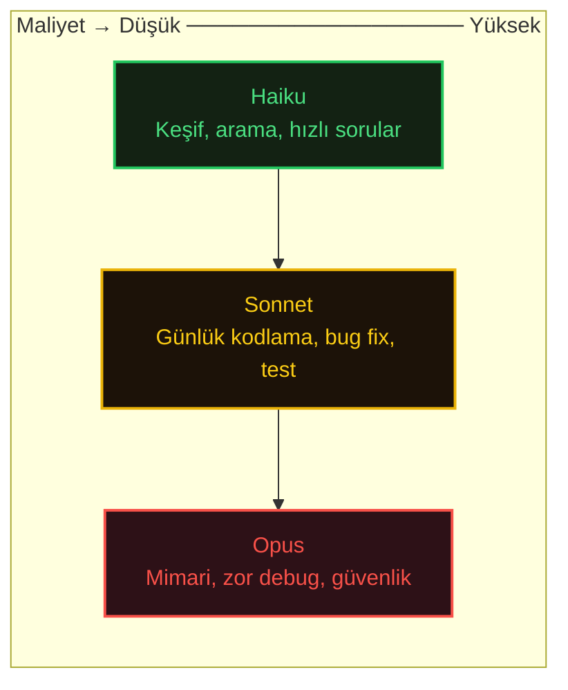
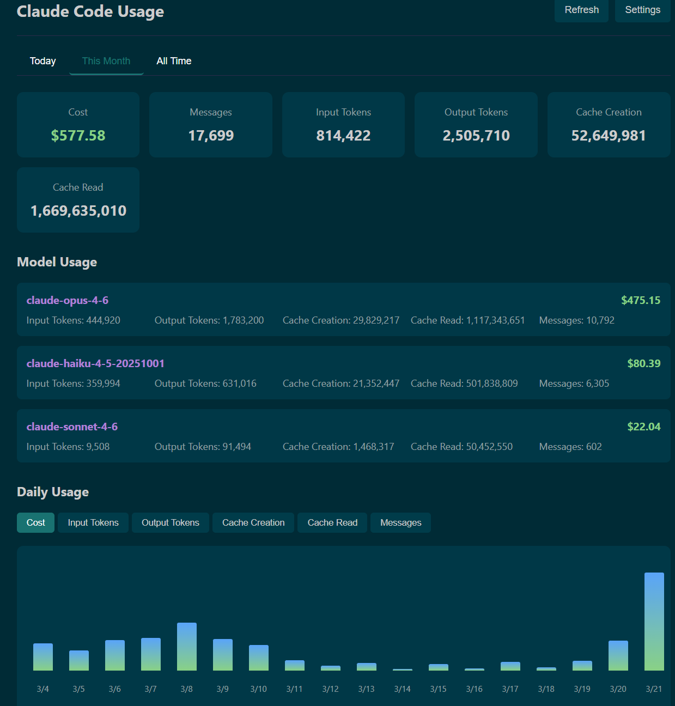

# Which Model Should I Choose?

Her görev için doğru modeli seçmek hem maliyeti hem kaliteyi önemli ölçüde etkiler. Claude Code birden fazla seviyede esnek model değiştirme sunar.

## Available Models

| Alias        | Model                          | Ne İçin                                 | Input/1M | Output/1M |
| ------------ | ------------------------------ | --------------------------------------- | -------- | --------- |
| `opus`       | **Claude Opus 4.6**            | Karmaşık muhakeme, mimari, long-context | \$5.00   | \$25.00   |
| `sonnet`     | **Claude Sonnet 4.6**          | Günlük kodlama, dengeli performans      | \$3.00   | \$15.00   |
| `haiku`      | Claude Haiku 4.5               | Basit görevler, hızlı işlemler          | \$1.00   | \$5.00    |
| `opus[1m]`   | Opus 4.6 + 1M context          | Büyük codebase'ler, uzun session'lar    | \$10.00  | \$37.50   |
| `sonnet[1m]` | Sonnet 4.6 + 1M context        | Büyük codebase'ler                      | \$6.00   | \$22.50   |
| `opusplan`   | Opus (plan) + Sonnet (execute) | Karmaşık refactoring                    | Hybrid   | Hybrid    |

**Opus 4.6 (5 Şubat 2026):** 1M token context window (beta), 128K max output, adaptive thinking ve agent teams destekli en güçlü model. Long context (>200K input) maliyeti $10/$37.50/MTok. Model ID: `claude-opus-4-6`.

**Sonnet 4.6 (17 Şubat 2026):** Sonnet 4.5'in yerini alan yeni dengeli model. Daha iyi agentic search performansı, daha az token tüketimi. Extended thinking, adaptive thinking ve 1M context window (beta) destekler. 64K max output. Model ID: `claude-sonnet-4-6`.

**Fiyat farkı neden önemli:** Tipik bir kodlama session'ı 50K-200K input ve 10K-50K output token tüketir. Haiku ile session başına $0.10-$0.45, Opus ile aynı session $0.50-$2.25 - 5 kat fark. Opus'u gerçekten zor problemler için saklayın.

## When to Use Each Model



**Haiku**: Keşif yapan subagent'lar, basit dosya aramaları, hızlı sorular. Opus'tan \~5 kat ucuz ve daha hızlı. Derin muhakeme gerektirmeyen arka plan görevleri için ideal.

**Sonnet**: Günlük geliştirmenin temel taşı. Feature geliştirme, bug düzeltme, test yazma, code review. Varsayılan modeliniz bu olmalı. **Sonnet 4.6** daha iyi agentic search ve token verimliliği sunar.

**Opus**: Gerçekten karmaşık muhakeme için: mimari kararlar, zor debugging, karmaşık sistemleri anlama, güvenlik analizi. **Opus 4.6** daha dikkatli planlar, agentic görevleri daha uzun sürdürür ve code review sırasında kendi hatalarını daha iyi yakalar. Pro subscription kullanıcıları Opus'a erişebilir.

**Opusplan**: Opus planlama + Sonnet uygulama hibrit modu. En iyi planı istediğiniz ama her düzenleme için Opus seviyesi muhakeme gerekmediği karmaşık refactoring'ler için mükemmel.

## Switching Models

**Session içinde:**

```
> /model opus
> /model sonnet
> /model haiku
```

**Başlangıçta:**

```
claude --model opus
```

**Environment ile:**

```
export ANTHROPIC_MODEL=opus
```

**Subagent'lar için:**

```
export CLAUDE_CODE_SUBAGENT_MODEL=haiku
```

## Extended Context

> Özellikle brownfield projelerde bir geliştirme yapılacağı zaman planlama aşamasında Opus 1M token context'i enable etmek oldukça faydalı ve iyi sonuçlar veriyor.

Büyük codebase'ler veya uzun session'lar için 1M token context'i etkinleştirin:

```
claude --model sonnet[1m]
claude --model opus[1m]
```

Session içinde:

```
> /model sonnet[1m]
> /model opus[1m]
```

**Opus 4.6** native 1M context destekli ilk Opus-class model. MRCR v2'nin 8-needle 1M varyantında %76 doğruluk (rakipler \~%18.5) ile long-context retrieval'da en güçlü model.

Extended context token başına daha pahalıdır (200K üstü input'ta 2x input, 1.5x output). Gerçekten ihtiyacınız olduğunda kullanın, varsayılan olarak değil.

## Fast Mode

Fast mode **aynı modelden** önemli ölçüde daha hızlı çıktı sağlar; daha ucuz bir modele geçmez. `/fast` ile açıp kapatın.

|        | Standard  | Fast Mode       |
| ------ | --------- | --------------- |
| Input  | \$5/MTok  | \$30/MTok (6x)  |
| Output | \$25/MTok | \$150/MTok (6x) |

Fast mode fiyatlandırması tüm context window boyunca geçerlidir - long context ek ücreti yoktur. Prompt caching ve data residency çarpanlarıyla birleşir ama long context fiyatlandırmasıyla birleşmez. Batch API ile kullanılamaz.

**Ne zaman kullanmalı:**

* Gecikmenin darboğaz olduğu küçük değişikliklerde hızlı iterasyon
* Test, boilerplate veya tekrarlayan kod üretimi
* Benzer görevlerin sıralı işlenmesi

**Ne zaman kullanmamalı:**

* Uzun süren agentic görevler (6x oranda maliyet hızla artar)
* Arka plan subagent işleri (çıktıyı kimse beklemiyor)
* Bütçe hassasiyeti olan session'lar

> Fast mode artık tam 1M context window içerir (v2.1.50+).

## Real-World Cost Examples

| Görev                     | Model        | Input | Output | Maliyet  |
| ------------------------- | ------------ | ----- | ------ | -------- |
| Hızlı dosya arama         | Haiku        | 20K   | 2K     | \$0.03   |
| Bug fix + test            | Sonnet       | 100K  | 30K    | \$0.75   |
| Mimari review             | Opus         | 150K  | 50K    | \$2.00   |
| Tam gün session (Sonnet)  | Sonnet       | 500K  | 150K   | \$3.75   |
| Tam gün session (karışık) | Haiku+Sonnet | 500K  | 150K   | \~\$2.00 |

> Ortalama maliyet geliştirici başına günde \~$6; kullanıcıların %90'ı günlük $12 altında kalıyor.

## VSCode Token & Cost Tracking Extensions

| Extension                          | Özellik                                                               | Link                                                                                                      |
| ---------------------------------- | --------------------------------------------------------------------- | --------------------------------------------------------------------------------------------------------- |
| **Claudemeter**                    | Pro/Max plan kota takibi, session limit, weekly limit, reset süreleri | [Marketplace](https://marketplace.visualstudio.com/items?itemName=hypersec.claudemeter)                   |
| **Claude Token Monitor**           | 11 dil desteği, auto-plan detection, interactive dashboard            | [Marketplace](https://marketplace.visualstudio.com/items?itemName=Wilendar.claude-usage-monitor)          |
| **Claude Code Usage Tracker**      | Gerçek zamanlı token/maliyet takibi, session yönetimi                 | [Marketplace](https://marketplace.visualstudio.com/items?itemName=YahyaShareef.claude-code-usage-tracker) |
| **Claude Code Status Bar Monitor** | Status bar'da token, maliyet ve mesaj sayısı                          | [Marketplace](https://marketplace.visualstudio.com/items?itemName=bartosz-warzocha.claude-statusbar)      |
| **Claude Code Usage Monitor**      | Status bar'da usage ve maliyet izleme                                 | [Marketplace](https://marketplace.visualstudio.com/items?itemName=suzuki0430.ccusage-vscode)              |

<p align="center">
  
</p>

## Langfuse - Agentic App Observability

[Langfuse](https://langfuse.com/), agentic uygulamaların model kullanımını, maliyetini ve davranışını trace eden open-source bir LLM observability platformudur.

**Ne işe yarar:**

* Her LLM çağrısını, tool kullanımını, retrieval işlemini ve embedding'i detaylı trace'ler halinde loglar
* Token tüketimi ve maliyeti gerçek zamanlı izler
* Multi-turn konuşmaları session bazında analiz eder
* Latency darboğazlarını tespit eder

**Ne sunar:**

| Özellik               | Açıklama                                                                       |
| --------------------- | ------------------------------------------------------------------------------ |
| **Tracing**           | LLM call, tool use, retrieval ve embedding'lerin uçtan uca trace kaydı         |
| **Cost Tracking**     | Model bazında token tüketimi ve maliyet analizi                                |
| **Prompt Management** | Prompt'ları merkezi olarak versiyonla, A/B test yap, cache'le                  |
| **Evaluations**       | LLM-as-a-judge, kullanıcı feedback, manuel labeling, custom eval pipeline'ları |
| **Integrations**      | OpenAI, LangChain, LlamaIndex, OpenTelemetry ve 50+ framework desteği          |

**Neden önemli:** Claude Code ile agentic uygulama geliştirdiğinizde, production'da hangi agent'ın hangi tool'u ne kadar token harcayarak çağırdığını, nerede hata yaptığını ve maliyetin nereye gittiğini görmek kritiktir. Langfuse tam olarak bu görünürlüğü sağlar.

> Open-source (MIT lisansı), self-host edilebilir. 19.000+ GitHub star. Python ve JavaScript SDK'ları mevcut.
>
> **Kaynak:** [langfuse.com](https://langfuse.com/) · [GitHub](https://github.com/langfuse/langfuse) · [Video](https://www.youtube.com/watch?v=pTneXS_m1rk)

