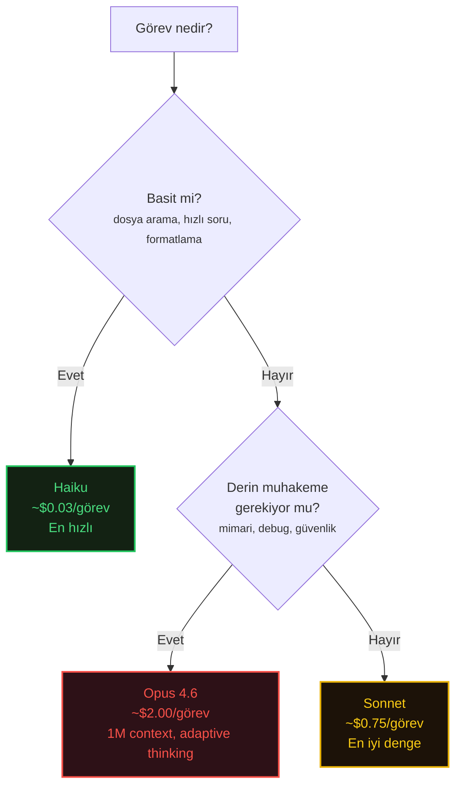
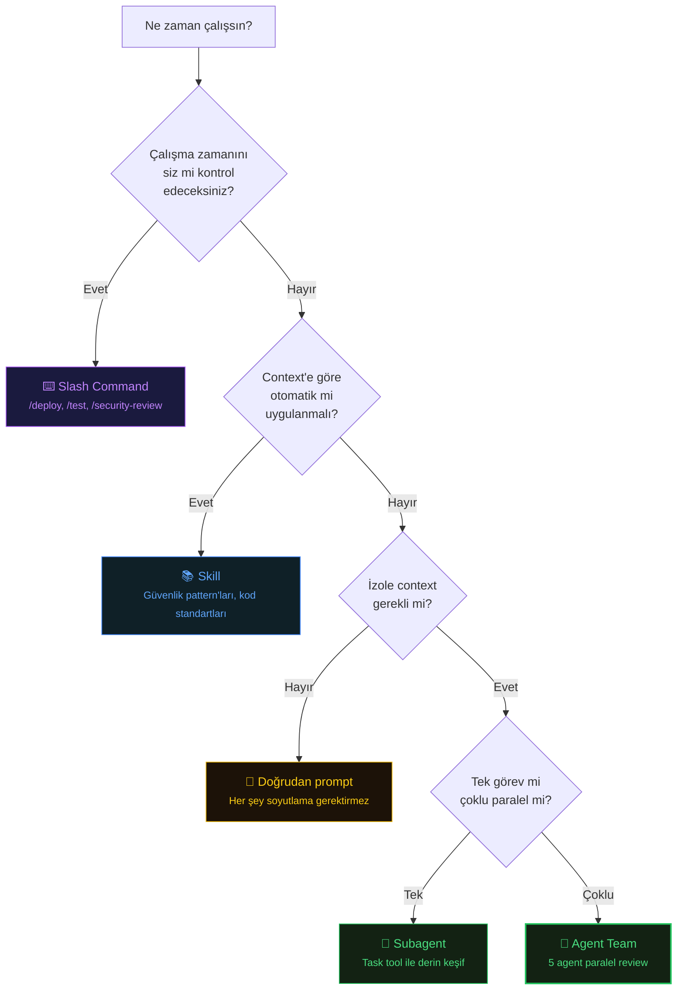
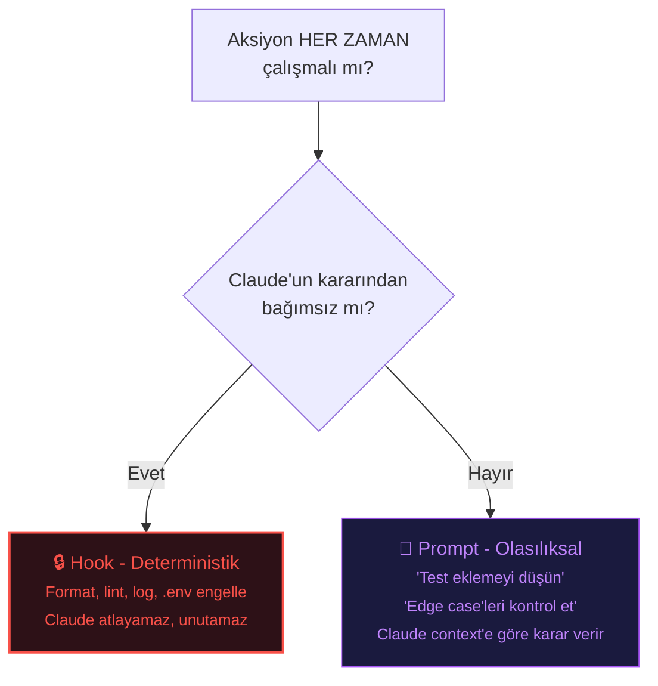
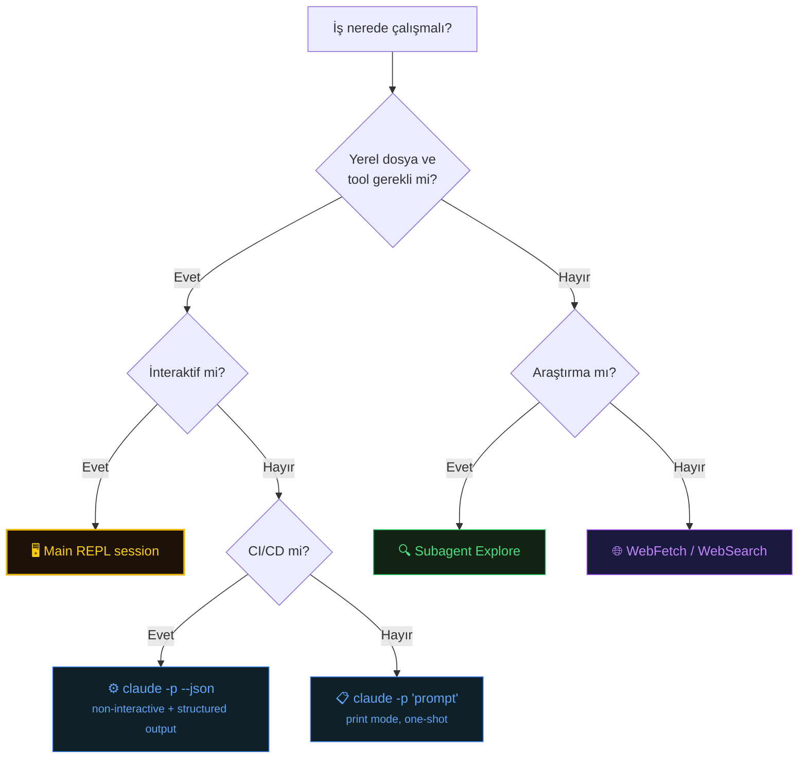
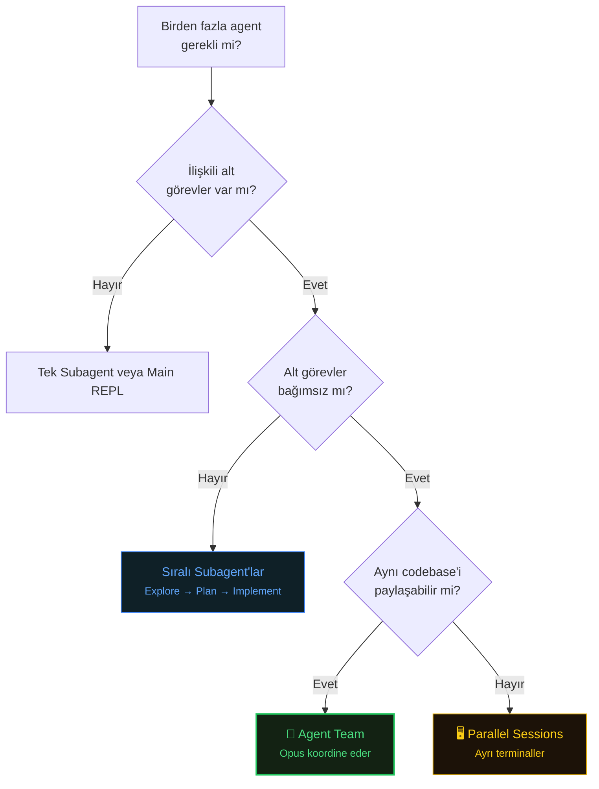
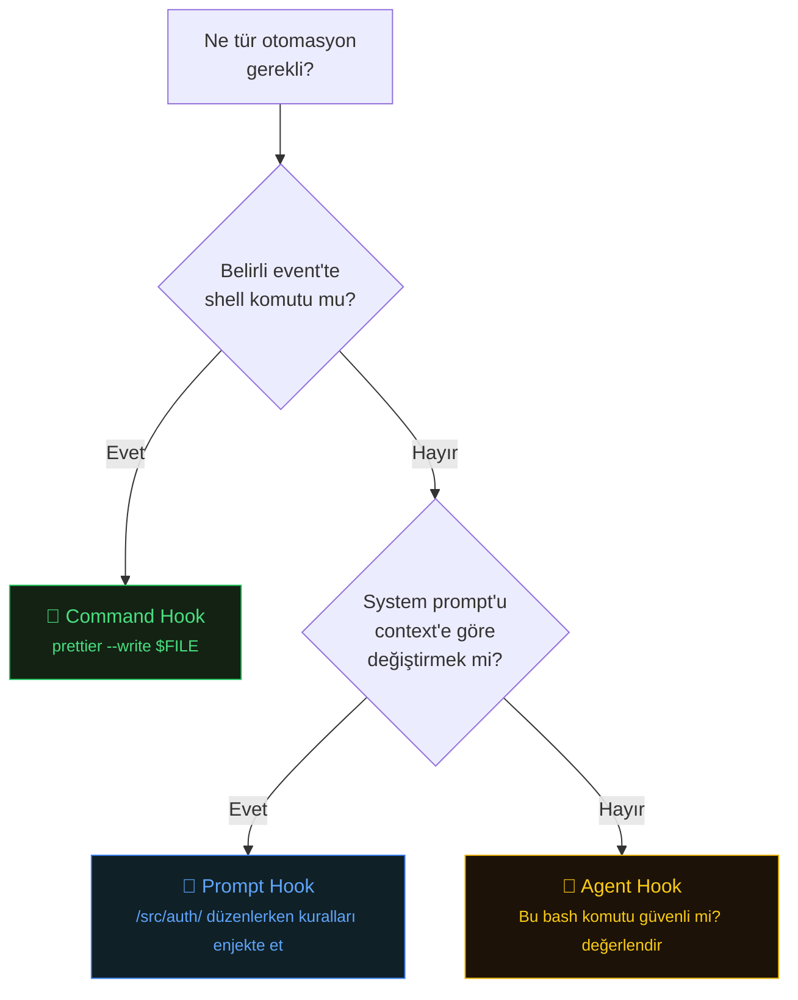
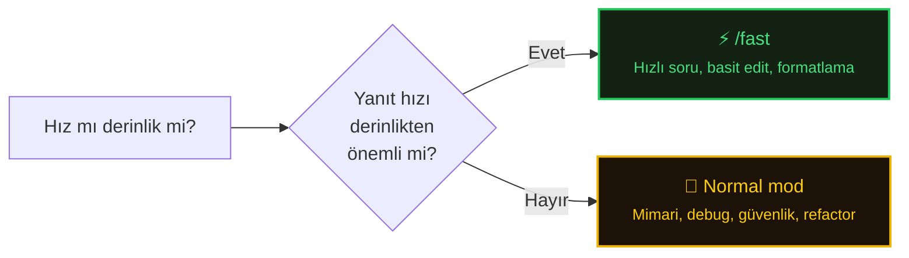

# Decision Frameworks

Özellikleri bilmek yetmez. Her birini ne zaman kullanacağınızı bilmeniz gerekir. Bu karar ağaçları bilgiyi eyleme dönüştürür.

## Which Model Should I Use?

## Command vs Skill vs Subagent vs Agent Team?

## Hook vs Prompt?

## When to Use Extended Thinking?

| Durum                                         | Extended Thinking? |
| --------------------------------------------- | ------------------ |
| Birçok trade-off içeren mimari karar          | ✅ Evet             |
| Kök nedeni belirsiz karmaşık debugging        | ✅ Evet             |
| Dikkatli muhakeme gerektiren güvenlik analizi | ✅ Evet             |
| Tanımadığınız codebase'i anlama               | ✅ Evet             |
| Rutin bug fix                                 | ❌ Hayır            |
| Basit refactoring                             | ❌ Hayır            |
| Kod formatlama                                | ❌ Hayır            |
| Hızlı sorular                                 | ❌ Hayır            |

Session içinde `Alt+T` ile açıp kapatın. Yüksek thinking budget'ı daha pahalıdır; minimumdan başlayın, yanıtlar acele hissettirirse artırın.

> **Opus 4.6 adaptive thinking:** Opus 4.6, problem karmaşıklığına göre thinking derinliğini otomatik ayarlar. Çoğu görev için manuel thinking kontrolü gerekmez - zor problemlerde derinleşir, basit olanlarda hızlı kalır. Manuel thinking toggle'ı en çok Sonnet'te daha derin analiz zorlamak istediğinizde işe yarar.

## Which Execution Surface?

| Senaryo                      | Yüzey                   | Neden                              |
| ---------------------------- | ----------------------- | ---------------------------------- |
| Hatalı test debug            | Main REPL               | Yerel dosyalar, iteratif           |
| 20 GitHub issue triage       | Background agent        | Uzun süren, yerel dosya gereksiz   |
| PR review                    | Subagent veya --from-pr | İzole context, odaklı çıktı        |
| Changelog oluşturma          | `claude -p`             | One-shot, scriptable               |
| Her commit'te lint + test    | Hook (PreCommit)        | Her zaman çalışmalı, deterministik |
| Repo'lar arası pattern arama | Subagent (Explore)      | Context bloat'u önler              |
| Hızlı kod açıklama           | Main REPL veya /fast    | İnteraktif, hızlı yanıt            |
| Multi-modül refactor         | Agent team              | Dosyalar arası paralel çalışma     |

## Agent Teams vs Subagents vs Parallel Sessions

| Yaklaşım          | Max Parallelism             | Paylaşılan Context                | Koordinasyon                |
| ----------------- | --------------------------- | --------------------------------- | --------------------------- |
| Agent Team        | 5-10 agent                  | Paylaşılan repo, ayrı context'ler | Opus koordine eder          |
| Subagents         | Sınırsız (siz yönetirsiniz) | Yok (izole)                       | Prompt ile siz yönetirsiniz |
| Parallel Sessions | Terminal sayısıyla sınırlı  | Yok                               | Manuel                      |

## Which Hook Type?

**Hook event'leri:** `PreToolUse` · `PostToolUse` · `Notification` · `Stop` · `SubagentStop`

## When to Use /fast?

`/fast` aynı modeli (Opus 4.6) optimize edilmiş çıktı hızıyla kullanır - daha ucuz bir modele geçmez.
