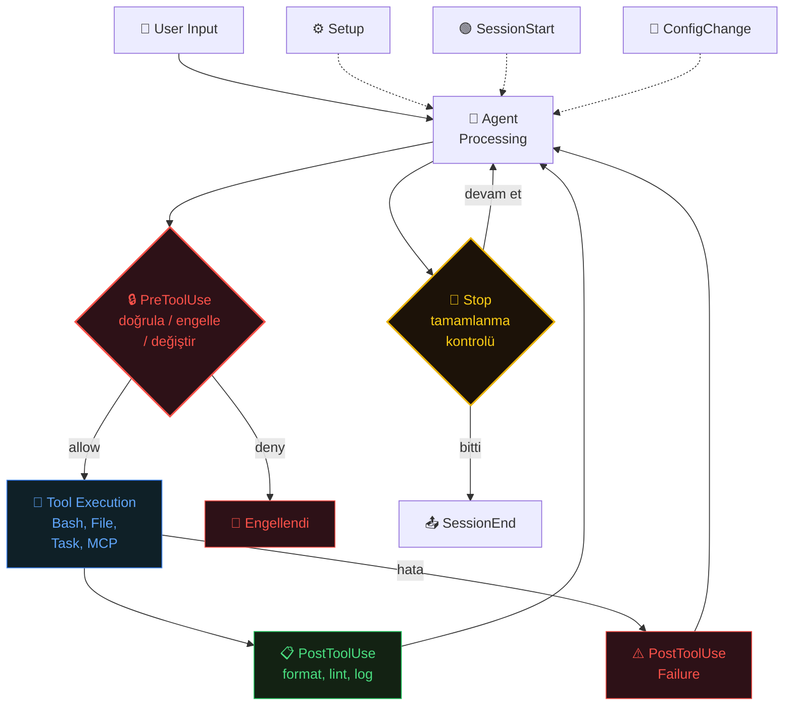
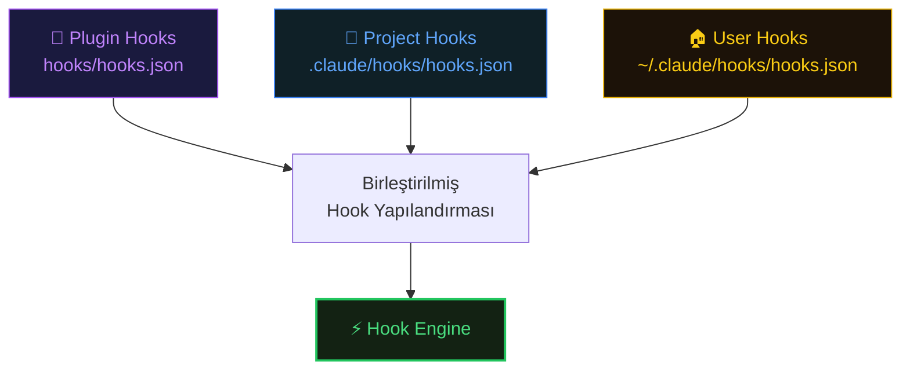
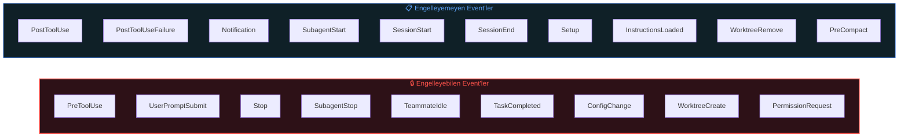

# How Do Hooks Work?

Hook'lar, Claude Code'un workflow'unda belirli noktalarda deterministik shell komutları çalıştırır. Claude'a aksiyon yaptırmaktan farklı olarak, hook'lar model davranışından bağımsız çalışmayı garanti eder. Takım standartlarını uygulamak ve tekrarlayan görevleri otomasyona almak için vazgeçilmezdir.

> Hook vs Prompt karar ağacı için bkz. [03-Decision-Framework.md](03-Decision-Framework.md#hook-vs-prompt)

**Neden hook, neden prompt değil:** Claude'a "her düzenlemeden sonra Prettier çalıştır" demek bazen işe yarar. Ama Claude unutabilir, hızı öncelikleyebilir veya değişikliğin "çok küçük" olduğuna karar verebilir. Hook'lar çalışmayı garanti eder: her Edit veya Write formatter'ı tetikler, her seferinde, istisnasız.

## Hook System Integration Flow

Hook'ların agent lifecycle içindeki yeri ve tetiklenme sırası:



## Hook Discovery & Loading

Hook'lar üç seviyeden yüklenir — plugin hook'ları kurulumla birlikte anında aktif olur, tüm seviyeler hot-reload destekler:



> **Kaynak:** [DeepWiki — Hook System](https://deepwiki.com/anthropics/claude-code/3.4-hook-system)

## Available Events



| Event              | Zamanlama                         | Engeller | Amaç                                              |
| ------------------ | --------------------------------- | -------- | ------------------------------------------------- |
| PreToolUse         | Tool çalışmadan önce              | ✅        | Doğrulama, loglama veya engelleme                 |
| PostToolUse        | Tool tamamlandıktan sonra         | ❌        | Format, lint, build tetikleme                     |
| PostToolUseFailure | Tool başarısız olduktan sonra     | ❌        | Hata loglama, alert gönderme                      |
| UserPromptSubmit   | Kullanıcı prompt gönderdiğinde    | ✅        | Context ekleme, input doğrulama                   |
| Notification       | Alert tetiklendiğinde             | ❌        | Özel bildirim yönetimi                            |
| Stop               | Claude yanıtı tamamladığında      | ✅        | Erken durmayı önleme, tamamlanma kriterleri       |
| SubagentStart      | Subagent başlatıldığında          | ❌        | Agent tipini loglama, context enjekte etme        |
| SubagentStop       | Subagent tamamlandığında          | ✅        | Kalite kapıları uygulama                          |
| TeammateIdle       | Agent team üyesi boşta kaldığında | ✅        | Kalite kapıları (v2.1.33+)                        |
| TaskCompleted      | Task tamamlandığında              | ✅        | Tamamlanma kriterleri, test çalıştırma (v2.1.33+) |
| SessionStart       | Session başladığında              | ❌        | Ortam kurulumu, context yükleme                   |
| SessionEnd         | Session kapandığında              | ❌        | Temizlik, son loglama                             |
| Setup              | --init/--maintenance flag'leri    | ❌        | Ortam kurulum görevleri (v2.1.10+)                |
| InstructionsLoaded | CLAUDE.md yüklendiğinde           | ❌        | Talimat dosyası değişikliklerine tepki (v2.1.69+) |
| ConfigChange       | Config dosyası değiştiğinde       | ✅        | Ayar değişikliklerini denetleme (v2.1.49+)        |
| WorktreeCreate     | Worktree oluşturulurken           | ✅        | Özel VCS kurulumu (v2.1.50+)                      |
| WorktreeRemove     | Worktree kaldırılırken            | ❌        | Özel VCS temizliği (v2.1.50+)                     |
| PreCompact         | Context compaction öncesi         | ❌        | Doğrulama, loglama                                |
| PermissionRequest  | İzin dialogu gösterildiğinde      | ✅        | Özel onay mantığı                                 |

## Hook Configuration

Hook'ları `settings.json` veya ayrı bir `hooks.json` dosyasında tanımlayın:

```JSON
{
  "hooks": {
    "PostToolUse": [
      {
        "matcher": "Edit|Write",
        "hooks": [
          {
            "type": "command",
            "command": "npx prettier --write \"$FILE_PATH\""
          }
        ]
      }
    ],
    "PreToolUse": [
      {
        "matcher": "Bash",
        "hooks": [
          {
            "type": "command",
            "command": ".claude/hooks/validate-bash.sh"
          }
        ]
      }
    ],
    "UserPromptSubmit": [
      {
        "matcher": "",
        "hooks": [
          {
            "type": "command",
            "command": ".claude/hooks/inject-context.sh"
          }
        ]
      }
    ]
  }
}
```

## Matchers

`matcher` alanı hangi tool'ların hook'u tetikleyeceğini belirler:

```JSON
{"matcher": "*"}              // Tüm tool'ları eşleştir
{"matcher": "Bash"}           // Sadece Bash
{"matcher": "Edit|Write"}     // Edit veya Write
{"matcher": "mcp__github"}    // MCP server tool'ları
{"matcher": ""}               // Tool'suz event'ler (ör. UserPromptSubmit)
```

## Hook Input/Output Protocol

Hook'lar stdin üzerinden JSON alır:

```JSON
{
  "tool_name": "Bash",
  "tool_input": {
    "command": "npm test",
    "description": "Run test suite"
  },
  "session_id": "abc-123"
}
```

Tüm hook event'leri subagent veya `--agent` session'dan tetiklendiğinde `agent_id` ve `agent_type` alanlarını içerir.

**Stop/SubagentStop hook'ları** ek olarak `last_assistant_message` alanı alır — Claude'un son yanıtını transcript dosyalarını parse etmeden incelemenizi sağlar:

```JSON
{
  "session_id": "abc-123",
  "last_assistant_message": "Refactoring'i tamamladım. İşte değişenler..."
}
```

## Hook Output & Control

Gelişmiş kontrol için hook'lar JSON çıktısı verebilir:

```JSON
{
  "decision": "allow",
  "message": "Komut doğrulandı ve değiştirildi",
  "modifications": {
    "tool_input": {
      "command": "npm test -- --coverage"
    }
  }
}
```

**PreToolUse karar kontrolü (tercih edilen format):** `hookSpecificOutput` ile üç sonuç (`allow`/`deny`/`ask`) artı tool input değiştirme ve context enjekte etme:

```JSON
{
  "hookSpecificOutput": {
    "hookEventName": "PreToolUse",
    "permissionDecision": "allow",
    "permissionDecisionReason": "Komut doğrulandı ve değiştirildi",
    "updatedInput": {
      "command": "npm test -- --coverage --ci"
    },
    "additionalContext": "Not: Bu veritabanının 5 saniye query timeout'u var."
  }
}
```

| Alan                     | Değerler               | Açıklama                                                   |
| ------------------------ | ---------------------- | ---------------------------------------------------------- |
| permissionDecision       | `allow`, `deny`, `ask` | allow izinleri atlar, deny engeller, ask kullanıcıya sorar |
| permissionDecisionReason | String                 | Kullanıcıya (allow/ask) veya Claude'a (deny) gösterilir    |
| updatedInput             | Object                 | Çalışma öncesi tool input'unu değiştirir                   |
| additionalContext        | String                 | O tur için Claude'un context'ine enjekte edilir            |

## Hook Types

### Command Hook

Klasik shell komutu çalıştırır:

```JSON
{
  "type": "command",
  "command": "npx prettier --write \"$FILE_PATH\""
}
```

### Prompt Hook

Hızlı bir Claude modeline tek turlu prompt gönderir. Model `{ "ok": true }` (izin ver) veya `{ "ok": false, "reason": "..." }` (engelle) döndürür:

```JSON
{
  "type": "prompt",
  "prompt": "Claude'un durması gerekip gerekmediğini değerlendir: $ARGUMENTS. Tüm istenen görevlerin tamamlanıp tamamlanmadığını ve testlerin geçip geçmediğini kontrol et.",
  "timeout": 30
}
```

### HTTP Hook

Event'in JSON input'unu bir URL'ye POST olarak gönderir. Webhook'lar, harici bildirim servisleri veya API tabanlı doğrulama için kullanın:

```JSON
{
  "type": "http",
  "url": "https://api.example.com/notify",
  "headers": {
    "Authorization": "Bearer $MY_TOKEN"
  },
  "allowedEnvVars": ["MY_TOKEN"]
}
```

HTTP hook'ları sandbox etkinleştirildiğinde sandbox ağ proxy'si üzerinden yönlendirilir. SessionStart/Setup event'lerinde desteklenmez.

### Agent Hook

Dosya inceleme gerektiren çok turlu doğrulama için tool erişimli (Read, Grep, Glob) bir subagent başlatır:

```JSON
{
  "type": "agent",
  "prompt": "Tüm unit testlerin geçtiğini doğrula. Test suite'ini çalıştır ve sonuçları kontrol et. $ARGUMENTS",
  "timeout": 120
}
```

**Önemli noktalar:**

* `$ARGUMENTS` hook'un JSON input'u için placeholder
* Her iki tip de `model` (varsayılan hızlı model) ve `timeout` alanlarını destekler
* **Desteklenen event'ler:** PreToolUse, PostToolUse, PostToolUseFailure, PermissionRequest, UserPromptSubmit, Stop, SubagentStop, TaskCompleted
* TeammateIdle prompt/agent hook desteklemez

### Async Hook

Hook'lar Claude Code'un çalışmasını engellemeden arka planda çalışabilir. `async: true` ekleyin:

```JSON
{
  "type": "command",
  "command": ".claude/hooks/notify-slack.sh",
  "async": true
}
```

**Ne zaman async:** Bildirimler (Slack, email), loglama, telemetri, kritik olmayan post-processing.

**Ne zaman sync:** Formatlama (sonraki edit'ten önce tamamlanmalı), doğrulama (hatada engellemeli), tool input/output değiştiren her hook.

## Hook Environment Variables

| Değişken                | Erişim              | Açıklama                                       |
| ----------------------- | ------------------- | ---------------------------------------------- |
| `$CLAUDE_PROJECT_DIR`   | Tüm hook'lar        | Proje kök dizini                               |
| `${CLAUDE_PLUGIN_ROOT}` | Plugin hook'ları    | Plugin'in kök dizini                           |
| `$CLAUDE_ENV_FILE`      | Sadece SessionStart | Bash komutları için env var persist dosya yolu |
| `$CLAUDE_CODE_REMOTE`   | Tüm hook'lar        | Remote web ortamlarında "true"                 |

## Practical Hook Examples

**Go dosyalarını düzenleme sonrası otomatik formatla:**

```JSON
{
  "PostToolUse": [{
    "matcher": "Edit|Write",
    "hooks": [{
      "type": "command",
      "command": "bash -c '[[ \"$FILE_PATH\" == *.go ]] && gofmt -w \"$FILE_PATH\" || true'"
    }]
  }]
}
```

**Tüm bash komutlarını logla:**

```JSON
{
  "PreToolUse": [{
    "matcher": "Bash",
    "hooks": [{
      "type": "command",
      "command": "jq -r '.tool_input.command' >> ~/.claude/bash-history.log"
    }]
  }]
}
```

**Hassas dosyalara erişimi engelle:**

```Shell
#!/bin/bash
# .claude/hooks/protect-files.sh
data=$(cat)
path=$(echo "$data" | jq -r '.tool_input.file_path // empty')

if [[ "$path" == *".env"* ]] || [[ "$path" == *"secrets/"* ]] || [[ "$path" == *".pem"* ]]; then
  echo "Engellendi: Hassas dosyaya erişilemez $path" >&2
  exit 2  # Exit 2 = tool çağrısını engelle. Exit 1 = engellemesiz hata.
fi
exit 0
```

**Kod değişikliklerinden sonra test çalıştır:**

```JSON
{
  "PostToolUse": [{
    "matcher": "Edit",
    "hooks": [{
      "type": "command",
      "command": "bash -c '[[ \"$FILE_PATH\" == *.go ]] && go test -v \"$(dirname \"$FILE_PATH\")\" || true'"
    }]
  }]
}
```

> `$FILE_PATH` kullanarak sadece değişen dosyanın paketini test eder. Tüm paketler için `go test ./... -v` kullanın.

**Özel bildirim sistemi:**

```JSON
{
  "Notification": [{
    "matcher": "",
    "hooks": [{
      "type": "command",
      "command": "notify-send 'Claude Code' 'Girdinizi bekliyor'"
    }]
  }]
}
```

**Go module'lerini otomatik temizle (go.mod/go.sum):**

```JSON
{
  "PostToolUse": [{
    "matcher": "Edit",
    "hooks": [{
      "type": "command",
      "command": "bash -c 'cd \"$(dirname \"$FILE_PATH\")\" && [[ -f go.mod ]] && go mod tidy || true'"
    }]
  }]
}
```

## Language-Specific Hook Examples

### Go

**golangci-lint ile statik analiz:**

```json
{
  "PostToolUse": [{
    "matcher": "Edit|Write",
    "hooks": [{
      "type": "command",
      "command": "bash -c '[[ \"$FILE_PATH\" == *.go ]] && golangci-lint run \"$(dirname \"$FILE_PATH\")/...\" --fix --timeout 30s 2>&1 || true'"
    }]
  }]
}
```

**Go build kontrolü — derleme hatası varsa Claude'a bildir:**

```json
{
  "PostToolUse": [{
    "matcher": "Edit|Write",
    "hooks": [{
      "type": "command",
      "command": "bash -c '[[ \"$FILE_PATH\" == *.go ]] && go build ./... 2>&1 || echo \"BUILD FAILED: Claude should fix compilation errors before continuing\"'"
    }]
  }]
}
```

**Go race detector ile test:**

```json
{
  "PostToolUse": [{
    "matcher": "Edit",
    "hooks": [{
      "type": "command",
      "command": "bash -c '[[ \"$FILE_PATH\" == *.go ]] && go test -race -v \"$(dirname \"$FILE_PATH\")/...\" || true'"
    }]
  }]
}
```

### .NET / C#

**dotnet format ile otomatik formatlama:**

```json
{
  "PostToolUse": [{
    "matcher": "Edit|Write",
    "hooks": [{
      "type": "command",
      "command": "bash -c '[[ \"$FILE_PATH\" == *.cs ]] && dotnet format --include \"$FILE_PATH\" || true'"
    }]
  }]
}
```

**dotnet build — derleme kontrolü:**

```json
{
  "PostToolUse": [{
    "matcher": "Edit|Write",
    "hooks": [{
      "type": "command",
      "command": "bash -c '[[ \"$FILE_PATH\" == *.cs ]] && dotnet build --no-restore 2>&1 || echo \"BUILD FAILED: Fix compilation errors\"'"
    }]
  }]
}
```

**Değişen dosyanın unit testlerini çalıştır:**

```json
{
  "PostToolUse": [{
    "matcher": "Edit",
    "hooks": [{
      "type": "command",
      "command": "bash -c '[[ \"$FILE_PATH\" == *.cs ]] && dotnet test --no-build --filter \"FullyQualifiedName~$(basename \"${FILE_PATH%.cs}\")\" || true'"
    }]
  }]
}
```

**NuGet paketlerini doğrula (güvenlik açığı kontrolü):**

```json
{
  "PostToolUse": [{
    "matcher": "Edit|Write",
    "hooks": [{
      "type": "command",
      "command": "bash -c '[[ \"$FILE_PATH\" == *.csproj ]] && dotnet list package --vulnerable --include-transitive 2>&1 || true'"
    }]
  }]
}
```

### TypeScript / JavaScript

**ESLint + Prettier zinciri:**

```json
{
  "PostToolUse": [{
    "matcher": "Edit|Write",
    "hooks": [{
      "type": "command",
      "command": "bash -c '[[ \"$FILE_PATH\" == *.ts || \"$FILE_PATH\" == *.tsx ]] && npx eslint --fix \"$FILE_PATH\" && npx prettier --write \"$FILE_PATH\" || true'"
    }]
  }]
}
```

**Type check — tsc ile derleme kontrolü:**

```json
{
  "PostToolUse": [{
    "matcher": "Edit|Write",
    "hooks": [{
      "type": "command",
      "command": "bash -c '[[ \"$FILE_PATH\" == *.ts ]] && npx tsc --noEmit 2>&1 || echo \"TYPE ERROR: Claude should fix before continuing\"'"
    }]
  }]
}
```

### Python

**Black + Ruff formatlama:**

```json
{
  "PostToolUse": [{
    "matcher": "Edit|Write",
    "hooks": [{
      "type": "command",
      "command": "bash -c '[[ \"$FILE_PATH\" == *.py ]] && black \"$FILE_PATH\" && ruff check --fix \"$FILE_PATH\" || true'"
    }]
  }]
}
```

**pytest ile değişen modülü test et:**

```json
{
  "PostToolUse": [{
    "matcher": "Edit",
    "hooks": [{
      "type": "command",
      "command": "bash -c '[[ \"$FILE_PATH\" == *.py ]] && python -m pytest \"$(dirname \"$FILE_PATH\")\" -x -q || true'"
    }]
  }]
}
```

## Component-Scoped Hooks

Hook'lar Skill'ler, subagent'lar ve slash command'larda frontmatter ile doğrudan tanımlanabilir. Bu hook'lar bileşenin yaşam döngüsüne göre kapsamlanır ve yalnızca o bileşen aktifken çalışır.

```YAML
---
name: secure-deployment
description: Güvenlik doğrulamalı deployment skill
hooks:
  PreToolUse:
    - matcher: Bash
      command: ".claude/hooks/validate-deploy.sh"
  PostToolUse:
    - matcher: Bash
      command: ".claude/hooks/log-deploy.sh"
  Stop:
    - command: ".claude/hooks/cleanup.sh"
      once: true  # Session başına sadece bir kez çalıştır
---
```

`once` seçeneği (skill ve slash command'larda) hook'un session başına yalnızca bir kez çalışmasını sağlar — temizlik veya finalizasyon görevleri için kullanışlıdır.

## Long-Running Sessions Strategy

Gece boyunca veya gözetimsiz Claude Code session'ları için, hook'ları manuel müdahale olmadan Claude'u yolda tutacak şekilde yapılandırın. Temel içgörü: linting ve test hook'larını, Claude'u devam etmeden önce sorunları düzeltmeye zorlayan korkuluklar olarak kullanın.

**"Testler Geçene Kadar Durma" Pattern'ı:**

```JSON
{
  "PostToolUse": [{
    "matcher": "Edit",
    "hooks": [{
      "type": "command",
      "command": "npm run lint && npm run typecheck",
      "timeout": 60000
    }]
  }],
  "Stop": [{
    "hooks": [{
      "type": "command",
      "command": "npm test || echo 'Testler başarısız - Claude durmadan önce düzeltmeli'"
    }]
  }]
}
```

**Gece session stratejisi:**

* **Pre-flight check:** Setup hook ile ortamın hazır olduğunu doğrulayın
* **Sürekli doğrulama:** PostToolUse hook'ları her değişiklikten sonra test çalıştırır
* **Tamamlanma kapısı:** Stop hook'ları Claude "bitti" demeden önce tüm kabul kriterlerini doğrular
* **Bildirim:** Stop hook'ları Claude bitirdiğinde veya takıldığında Slack ile size haber verebilir

## Git Context Injection Hook — Örnek Uygulama

### Amaç

Her prompt gönderiminde otomatik olarak mevcut git branch'i, son commit'leri ve değiştirilmiş dosyaları Claude'a sunmak. Bu sayede Claude her zaman proje durumunun farkında olur.

### Implementasyon

**1. Hook script'i** (`.claude/hooks/inject-context.sh`):

```Shell
#!/bin/bash
branch=$(git branch --show-current 2>/dev/null)
commits=$(git log --oneline -3 2>/dev/null)
status=$(git status --short 2>/dev/null | head -5)

context_parts=()
[ -n "$branch" ] && context_parts+=("Branch: $branch")
[ -n "$commits" ] && context_parts+=("Recent commits:\n$commits")
[ -n "$status" ] && context_parts+=("Changed files:\n$status")

if [ ${#context_parts[@]} -gt 0 ]; then
  printf "%s\n" "${context_parts[@]}"
fi
exit 0
```

**2. Hook yapılandırması:**

```JSON
{
  "hooks": {
    "UserPromptSubmit": [{
      "matcher": "",
      "hooks": [{
        "type": "command",
        "command": ".claude/hooks/inject-context.sh"
      }]
    }]
  }
}
```

**3. Kullanım:**

```Shell
chmod +x .claude/hooks/inject-context.sh
```

Claude Code'u yeniden başlatın — hook otomatik olarak her prompt'ta çalışacak.

### Çıktı Örneği

```
Branch: feature/auth-system
Recent commits:
a1b2c3d Add: user authentication flow
d4e5f6g Fix: password validation regex
h7i8j9k Refactor: auth middleware
Changed files:
M  src/auth/login.ts
M  src/auth/middleware.ts
?? src/auth/types.ts
```

### Avantajları

* **Bağlamsal farkındalık** — Claude her zaman hangi branch'te ve ne üzerinde çalıştığını bilir
* **Otomatik enjeksiyon** — Manuel bilgi sağlamaya gerek yok
* **Hızlı ilişkilendirme** — Commit ve dosya değişiklikleri hemen görülür
* **Güvenlik** — Sadece proje klasörü içinde çalışır

### İleri Seviye Varyasyonlar

**Detaylı versiyon — branch, commits, staged/unstaged changes ve tags:**

```Shell
#!/bin/bash
branch=$(git branch --show-current 2>/dev/null)
commits=$(git log --oneline -5 2>/dev/null)
staged=$(git diff --cached --stat 2>/dev/null)
unstaged=$(git diff --stat 2>/dev/null)
tags=$(git describe --tags --abbrev=0 2>/dev/null)

echo "=== GIT CONTEXT ==="
[ -n "$branch" ] && echo "Branch: $branch"
[ -n "$tags" ] && echo "Latest Tag: $tags"
[ -n "$commits" ] && echo "Recent Commits:" && echo "$commits"
[ -n "$staged" ] && echo "Staged Changes:" && echo "$staged"
[ -n "$unstaged" ] && echo "Unstaged Changes:" && echo "$unstaged"
echo "==================="
exit 0
```

**Koşullu enjeksiyon — sadece değişiklik varsa:**

```Shell
#!/bin/bash
branch=$(git branch --show-current 2>/dev/null)
changes=$(git status --short 2>/dev/null)

if [ -z "$changes" ]; then
  echo "[Git: Everything committed on branch '$branch']"
else
  echo "[Git Context]"
  echo "Branch: $branch"
  echo "Changes:"
  echo "$changes"
fi
exit 0
```

### Entegrasyon İpuçları

* Hook'ları **sadece UserPromptSubmit**'te çalıştırarak minimal overhead yaratın
* Büyük repo'larda performans için `git log -1` veya `--oneline` kullanın
* Hassas branch adlarında filtreleme için `| grep -v "secret"` ekleyin
* Slack/Email bildirimleri için `PostToolUse` hook'larıyla kombine edin

