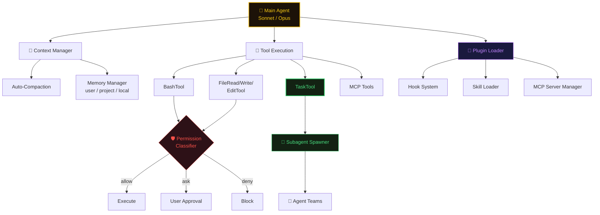
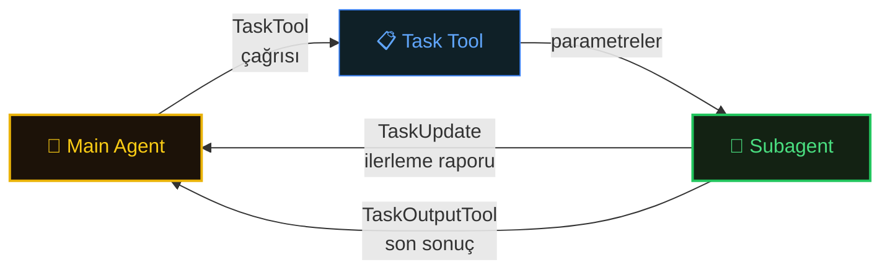
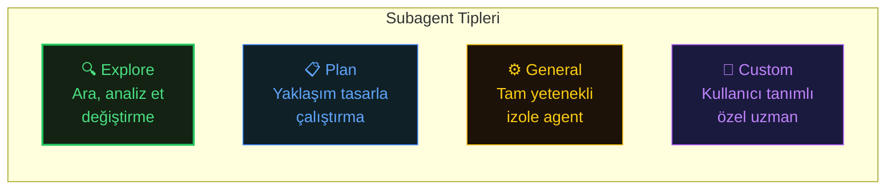
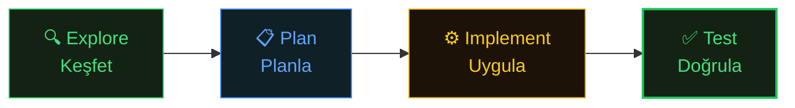
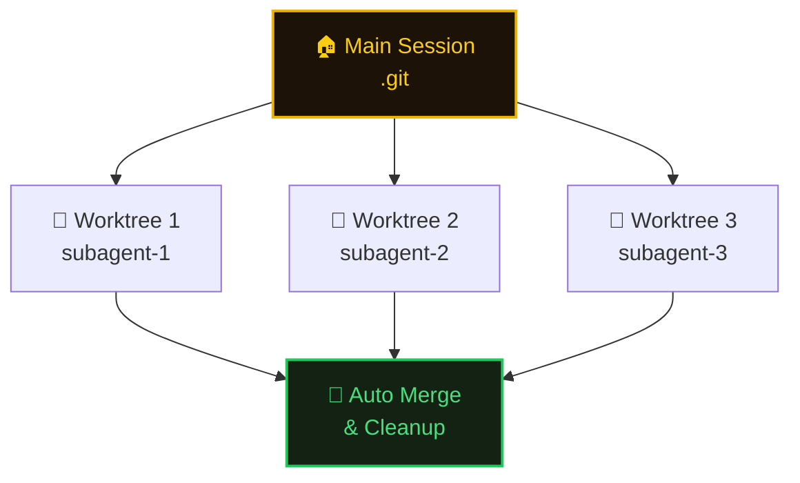

# What are Subagents?

Subagent'lar, ana session tarafından özelleşmiş görevleri yönetmek için başlatılan izole Claude instance'larıdır. Her subagent temiz bir context ile başlar, bağımsız çalışır ve yalnızca bir özet döndürür — ana konuşmada "context bloat"u önler.

**Temel sorun:** Tek bir konuşma penceresi dosya okumaları, tool çıktıları ve önceki kararlarla dolar. Context büyüdükçe Claude orijinal hedefleri kaybeder ve kalite düşer. Subagent'lar odaklanmış işleri temiz başlayan ayrı context'lere aktararak bunu çözer.

#### What is Context bloat?

Claude Code ile çalışırken her mesaj, dosya okuma, tool çıktısı ve önceki kararlar context window'a (200K veya 1M token) birikir. Bu birikime **context bloat** denir.

**Ne olur:**

* Claude önceki kararları ve hedefleri kaybetmeye başlar
* Yanıt kalitesi düşer
* Token maliyeti artar
* Session kullanılamaz hale gelir.

**Nasıl önlenir:**

* Keşif işlerini subagent'lara devret (sadece özet döner)
* `/compact` ile context'i özetle
* Session'ları kısa ve odaklı tut
* Her feature için yeni session başlat

Kısaca: context window'un gereksiz bilgiyle dolması = context bloat. Subagent'ların varlık sebebi bu.


**Key Insight:** Keşif ve özelleşmiş işleri delegation layer'a itin, core layer'ı yalnızca orkestrasyon için kullanın.

## Agent System Architecture

Main Agent, tool çağrıları üzerinden subagent'lar başlatır, context'i yönetir ve extension'larla etkileşir:



> **Kaynak:** [DeepWiki — Agent System and Subagents](https://deepwiki.com/anthropics/claude-code/3.1-agent-system-and-subagents)

## Creating Subagents with Task Tool

Main agent, **TaskTool** çağırarak subagent başlatır. Subagent bağımsız çalışır ve sonuçları **TaskOutputTool** ile raporlar.



**Task Tool parametreleri:**

| Parametre | Açıklama |
|-----------|----------|
| `description` | Doğal dil görev tanımı |
| `agent_type` | Kullanılacak agent profili (explore, plan, general) |
| `model` | Subagent için model override |
| `allowed_tools` | İzin verilen tool alt kümesi |
| `permission_mode` | Permission davranış override'ı |
| `context` | Context devralma modu (ör. `fork`) |

**Execution modes:**

| Mod | Çalışma Dizini | Kullanım |
|-----|---------------|----------|
| Default | Main agent ile paylaşımlı | Basit paralel görevler |
| `isolation: worktree` | Geçici git worktree | Dosya izolasyonu gereken görevler |
| `background: true` | Her iki mod | Non-blocking, uzun süren görevler |

**İletişim mekanizmaları:**

- **TaskUpdate**: Subagent tamamlanmadan ilerleme raporlar. Aktif görev listesinden görev silmek için de kullanılır.
- **TaskOutputTool**: Son sonuçları teslim eder — yanıt özeti (UI'da max 3 satır), tam transcript dosya referansı, metrikler (token sayısı, tool kullanımı, süre).

**Subagent lifecycle hook'ları:**

`SessionStart` → `WorktreeCreate` → `PreToolUse` → `PostToolUse` → `TaskCompleted` → `SessionEnd`

Hata durumunda `StopFailure`, takım üyesi bekliyorsa `TeammateIdle` tetiklenir.

## Subagent Types



| Tip         | Amaç                                   | Tool'lar                             | Örnek                                             |
| ----------- | -------------------------------------- | ------------------------------------ | ------------------------------------------------- |
| **Explore** | Aramak ve analiz etmek (değiştirmeden) | Read, Glob, Grep, WebSearch, LSP     | "Codebase'deki tüm TODO yorumlarını bul"          |
| **Plan**    | Yaklaşım tasarlamak (çalıştırmadan)    | Sadece Read tool'lar + yapısal çıktı | "Auth modülü için refactoring stratejisi tasarla" |
| **General** | Tam yetenekli izole agent              | Tüm tool'lar                         | "Feature X'i izole olarak implement et"           |
| **Custom**  | Kullanıcı tanımlı özel talimatlar      | Kullanıcı belirlediği tool seti      | Domain-specific uzmanlar                          |

## Spawning Subagents

**Session içinde otomatik:**

```
> "Authentication modülünü incele ve potansiyel güvenlik sorunlarını bul"
```

Claude otomatik olarak Explore subagent başlatabilir.

**Açık komutla:**

```
> /task explore "Tüm veritabanı query'lerini ara ve N+1 problemlerini tespit et"
> /task general "Kullanıcı profil sayfası component'ini implement et"
> /task plan "Bildirim sistemi için veritabanı şeması tasarla"
```

## Context Isolation

Her subagent şunlarla başlar:

* **Temiz context window** — önceki konuşma geçmişi yok
* **Dosya erişimi** — parent'tan proje yolu ve ek dizinleri devralır
* **Tool allowlist** — subagent tipine özel (Explore Edit/Write'ı engeller)
* **Model** — varsayılan parent model; daha ucuz seviyeye override edilebilir

**Maliyet etkisi:** Keşif için Haiku, implementation için Sonnet, orkestrasyon için Opus. Bu katmanlama, her şey için Opus kullanmaya kıyasla maliyeti %40-50 düşürebilir.

## Subagent Output

Subagent tamamlandığında Claude yalnızca özeti döndürür — tam transcript ana konuşmaya girmez:

```
[Subagent Result: Explore]
47 TODO yorumu bulundu:
- 12 src/auth'da (güvenlikle ilgili)
- 8 src/api'de (doğrulama gerekli)
- 15 src/ui'da (refactoring gerekli)

Temel bulgular:
1. Auth flow'da rate-limiting eksik
2. API endpoint'lerinde input validation yok
3. Birçok deprecated pattern hâlâ kullanımda
```

## Orchestration Patterns

### Sequential Pipeline



```
> /task explore "Eski authentication pattern'ını kullanan tüm dosyaları bul"
[23 lokasyon döner]

> /task plan "Her modül için paralel migrasyon stratejisi tasarla"
[Detaylı plan döner]

> /task general "src/auth'da migrasyonu implement et"
[Değişiklikleri uygular]

> /task general "Migrasyon için testleri yaz"
[Testleri yazar]
```

### Parallel Exploration

Birden fazla Explore subagent'ı eş zamanlı çalıştırın:

```
> /task explore "Database modülünde N+1 query'leri kontrol et"
> /task explore "API modülünde eksik validation'ları kontrol et"
> /task explore "UI modülünde accessibility sorunlarını kontrol et"
[Üçü paralel çalışır; özetler tamamlandıkça döner]
```

Claude Code 10'a kadar paralel subagent yönetir.

### Delegation with Quality Gates

SubagentStop hook'ları ile otomatik kalite kapıları uygulayın:

```JSON
{
  "hooks": {
    "SubagentStop": [{
      "hooks": [{
        "type": "agent",
        "prompt": "Test coverage'ın %85'i aştığını doğrula. Aşmıyorsa iyileştirme öner."
      }]
    }]
  }
}
```

## Agent Teams (v2.1.32+)

Gerçekten karmaşık görevler için **agent team'ler**, Opus tarafından koordine edilen birden fazla özelleşmiş agent'ı ilişkili alt görevler üzerinde paralel çalıştırır.

### Nasıl Çalışır

Bir hedef verirsiniz. Opus nasıl bölüneceğine karar verir:

* Codebase yapısını analiz eder
* Takım üyelerini farklı modüllere atar
* Çalışmalarını koordine eder
* Sonuçları birleştirir

```
> "Authentication'ı session-based'den JWT'ye tüm codebase'de refactor et"

[Opus takım kompozisyonuna karar verir]
Agent 1: Auth modülü core logic'ini refactor et
Agent 2: API endpoint'lerini JWT kullanacak şekilde güncelle
Agent 3: Frontend'i JWT token gönderecek şekilde güncelle
Agent 4: Database schema ve migration'ları güncelle

[Dört agent paralel çalışır]
[Opus ilerlemeyi izler, bağımlılıkları yönetir, uyumluluğu sağlar]
```

### Subagents vs Agent Teams

| Özellik          | Subagents                                            | Agent Teams                               |
| ---------------- | ---------------------------------------------------- | ----------------------------------------- |
| **Koordinasyon** | Siz prompt'larla yönetirsiniz                        | Opus otomatik yönetir                     |
| **Paralellik**   | Siz paralel başlatırsınız; bağımsızlar               | Opus bağımlılık ve senkronizasyon yönetir |
| **Karmaşıklık**  | Basit görevler (keşif, tek modül)                    | Karmaşık multi-modül refactor             |
| **Feedback**     | Siz özetleri inceler, sonraki adıma karar verirsiniz | Opus otonom devam kararı verir            |
| **Maliyet**      | Ucuz (Haiku/Sonnet)                                  | Pahalı (Opus orkestrasyon)                |

### Agent Teams Etkinleştirme

```Shell
export CLAUDE_CODE_EXPERIMENTAL_AGENT_TEAMS=1
```

Veya settings'te:

```JSON
{
  "env": {
    "CLAUDE_CODE_EXPERIMENTAL_AGENT_TEAMS": "1"
  }
}
```

Opus 10'a kadar agent'ı paralel koordine edebilir. Agent team'ler otomatik olarak iş dağıtımı, git merge conflict yönetimi, hata durumunda yeniden senkronizasyon ve ana session'a ilerleme raporlama yapar.

## Worktrees for Agent Parallelism (v2.1.26+)

Birden fazla agent eş zamanlı çalışırken, her birinin git conflict'lerini önlemek için kendi çalışma dizinine ihtiyacı vardır. Worktree'ler bunu otomatik sağlar.



Agent'lar tamamlandığında worktree'ler otomatik temizlenir. Özel VCS kurulumu için WorktreeCreate hook'ları kullanılabilir.

## Subagent Configuration

### Model Selection

```Shell
# Tüm subagent'lar için global override
export CLAUDE_CODE_SUBAGENT_MODEL=haiku
```

```JSON
{
  "subagentModelOverrides": {
    "explore": "haiku",
    "plan": "sonnet",
    "general": "sonnet",
    "custom-security-review": "opus"
  }
}
```

### Tool Constraints

```JSON
{
  "subagentPermissions": {
    "explore": ["Read", "Glob", "Grep", "WebSearch"],
    "plan": ["Read", "Glob", "Grep"],
    "general": ["Read", "Edit", "Write", "Bash", "Glob", "Grep"]
  }
}
```

### Token Budgets

```JSON
{
  "subagentContextLimits": {
    "explore": 100000,
    "plan": 150000,
    "general": 200000
  }
}
```

Subagent limitine yaklaştığında Claude Code otomatik compact yapar veya agent'ı durdurur.

## Performance Considerations

### Context Efficiency

| Senaryo                    | Context Büyümesi             | Maliyet                |
| -------------------------- | ---------------------------- | ---------------------- |
| Tek session, 5 keşif       | +500K token                  | \$3.75 (Opus)          |
| 5 Explore subagent (Haiku) | +100K token (sadece özetler) | \$0.15                 |
| **Tasarruf**               | **%80 azalma**               | **%96 maliyet düşüşü** |

### Latency

Subagent'lar hafif gecikme ekler (\~2-3 saniye spawning overhead).

**Subagent kullanın:**

* 30 saniyeden uzun görevler (overhead amortize olur)
* Büyük çıktı üreten keşifler (özetler context'i yalın tutar)
* Karmaşık çok adımlı işler

**Subagent kullanmayın:**

* Hızlı dosya aramaları (<5 saniye)
* Basit tek soruluk yanıtlar
* İteratif geri-bildirim çalışması

### Throughput

```
Sıralı:    3 × 60s = 180s
Paralel:   60s + network overhead ≈ 70s
Hızlanma:  2.5x
```

## Real-World Patterns

### Multi-Module Refactoring

```
> /task explore "Eski payment API'sini kullanan tüm dosyaları bul"
[15 dosya, 3 modül döner]

> /task plan "Her modül için paralel migrasyon stratejisi tasarla"
[Detaylı plan]

> /task general "src/payments'da migrasyonu uygula"
> /task general "src/billing'de migrasyonu uygula"
> /task general "src/reports'da migrasyonu uygula"
[Üçü eş zamanlı çalışır]

> /task general "Migrasyon için kapsamlı testler yaz"
[Entegrasyon noktalarını test eder]
```

### Codebase Audit

```
> /task explore "Hardcoded secret, API key, password bul"
> /task explore "SQL injection açıkları kontrol et"
> /task explore "Deprecated kütüphane kullanımlarını tespit et"
> /task explore "Yakalanmamış promise rejection'ları bul"
[Dört agent paralel arar; özetler döner]

> Bu bulgulara göre öncelikli remediation planı oluştur
[Ana konuşma sonuçları eyleme dönüştürür]
```

### Feature Development with Isolation

```
> /task general "Auth UI component'ini oluştur (src/components/Auth.tsx)"
> /task general "Auth API endpoint'ini implement et (src/routes/auth.ts)"
> /task general "Her ikisi için kapsamlı testler yaz"
[Üç agent ayrı concern'lerde bağımsız çalışır]

> /task plan "Üç implementasyonu entegrasyon boşlukları için incele"
[Plan agent dosyalara dokunmadan inceler]

> Üç implementasyonu birleştir ve birlikte çalıştığını doğrula
[Ana session son entegrasyonu yapar]
```

## Limitations and Gotchas

| Kısıtlama                                  | Açıklama                                                                          |
| ------------------------------------------ | --------------------------------------------------------------------------------- |
| **Subagent subagent başlatamaz**           | Recursive delegation yok. Subagent'lar tek seviye derinlikte                      |
| **Context izolasyonu tek yönlü**           | Parent'ın dosya context'ini devralır ama bellek/kısmi çalışma durumu paylaşamaz   |
| **Çalışma sırasında kullanıcı girişi yok** | Subagent'lar görev ortasında onay isteyemez, otonom çalışmalı                     |
| **Tool izinleri devralınmaz**              | Her subagent tipi için tool'ları açıkça izin vermelisiniz                         |
| **Paralel agent'larda race condition**     | İki agent aynı dosyayı değiştirirse sonraki üzerine yazabilir — worktree kullanın |
| **Paylaşılan bellek yok**                  | Subagent'lar long-term memory devralamaz, her biri sıfırdan başlar                |

## Debugging

```Shell
# Subagent transcript'ini görüntüle
> /show-transcript subagent-id

# Detaylı loglama
export CLAUDE_CODE_DEBUG_SUBAGENTS=1
```

Subagent'lar varsayılan 30 dakika timeout'a sahiptir. Ayarlanabilir:

```JSON
{
  "subagentTimeouts": {
    "explore": 300000,
    "plan": 600000,
    "general": 1800000
  }
}
```


