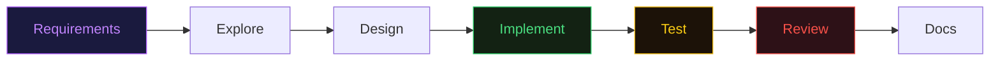

# Plugin System

Plugin'ler Claude Code extension'larını dağıtım için paketler. Bir plugin; custom command, subagent, skill, hook ve MCP server içerebilir. Anthropic, plugin marketplace'i Aralık 2025'te 36 küratörlü plugin ile resmi olarak başlattı.

## Plugin Structure

```
my-plugin/
├── .claude-plugin/
│   └── plugin.json              # Zorunlu: metadata
├── commands/                     # Slash command'lar
│   └── hello.md
├── agents/                       # Subagent'lar
│   └── helper.md
├── skills/                       # Skill'ler
│   └── my-skill/
│       └── SKILL.md
├── hooks/                        # Event handler'lar
│   └── hooks.json
└── .mcp.json                     # MCP server'lar
```

## Plugin Manifest

Minimal `plugin.json`:

```JSON
{
  "name": "my-plugin",
  "description": "Bu plugin ne yapar",
  "version": "1.0.0",
  "author": {
    "name": "Your Name"
  }
}
```

## Plugin Management

```
> /plugin                              # İnteraktif arayüz
> /plugin install name@marketplace     # Kur
> /plugin enable name@marketplace      # Etkinleştir
> /plugin disable name@marketplace     # Devre dışı bırak
> /plugin uninstall name@marketplace   # Kaldır
> /plugin marketplace add ./local      # Yerel marketplace ekle
> /plugin marketplace list             # Marketplace'leri listele
```

## Local Development

Test için yerel marketplace oluşturun:

```Shell
mkdir dev-marketplace && cd dev-marketplace
mkdir my-plugin
# Plugin yapısını oluştur

cd ..
claude
> /plugin marketplace add ./dev-marketplace
> /plugin install my-plugin@dev-marketplace
```

## Plugin Installation Improvements

Plugin'ler artık custom npm registry ve npm kaynaklarından kurulumda spesifik versiyon pinleme destekler.&#x20;

## Plugin Components

| Component       | Konum       | Davranış                                                 |
| --------------- | ----------- | -------------------------------------------------------- |
| **Commands**    | `commands/` | Slash command olarak kullanılabilir (`/plugin-command`)  |
| **Agents**      | `agents/`   | `/agents` listesinde görünür                             |
| **Skills**      | `skills/`   | Skill config'e göre otomatik yüklenir                    |
| **Hooks**       | `hooks/`    | User/project hook'larıyla birleştirilir, paralel çalışır |
| **MCP Servers** | `.mcp.json` | Plugin etkinleştirildiğinde otomatik başlar              |

## Custom Marketplace Oluşturma

Takımlar kendi marketplace'lerini GitHub repo olarak kurabilir. Her plugin bir alt dizin:

```
my-team-marketplace/
├── code-review-plugin/
│   └── .claude-plugin/
│       └── plugin.json
├── deploy-plugin/
│   └── .claude-plugin/
│       └── plugin.json
└── security-plugin/
    └── .claude-plugin/
        └── plugin.json
```

**GitHub'da yayınlama:**

```Shell
# 1. GitHub repo oluştur
gh repo create my-org/claude-marketplace --public

# 2. Plugin'leri ekle
cp -r code-review-plugin/ claude-marketplace/
cd claude-marketplace && git add -A && git commit -m "add plugins" && git push

# 3. Takım üyeleri marketplace'i ekler
> /plugin marketplace add my-org/claude-marketplace
> /plugin install code-review-plugin@my-org/claude-marketplace
```

**Yerel path ile:**

```Shell
# Network share veya monorepo içinden
> /plugin marketplace add /shared/team-plugins
> /plugin marketplace add ../tools/claude-plugins
```

**Marketplace yönetimi:**

```
> /plugin marketplace list              # Tüm marketplace'leri listele
> /plugin marketplace remove my-org/... # Marketplace kaldır
```

## Kullandığım Plugin'ler

### feature-dev

En popüler Claude Code plugin'i. Tek bir prompt ile 7 fazlı feature geliştirme workflow'u çalıştırır:



```Shell
# Kurulum
/plugin marketplace add feature-dev

# Kullanım
> /feature-dev "Kullanıcı profil sayfası ekle - avatar upload, bio düzenleme, şifre değiştirme"
```

Her faz otomatik çalışır: gereksinim toplar, codebase'i parallel agent'larla keşfeder, mimari tasarlar, implement eder, test yazar, review yapar ve dokümante eder.

### multi-agent-squad

Production-ready multi-agent orchestration plugin'i. Karmaşık görevleri birden fazla özelleşmiş agent'a böler ve koordine eder.

```Shell
# Kurulum
/plugin marketplace add multi-agent-squad
```

**Ne zaman kullanmalı:**

* Monolith-to-microservices migrasyon
* Cross-module refactoring
* Büyük codebase audit'leri
* Paralel feature geliştirme

**feature-dev vs multi-agent-squad:**

|                 | feature-dev                | multi-agent-squad                   |
| --------------- | -------------------------- | ----------------------------------- |
| **Odak**        | Tek feature, 7 fazlı döngü | Çoklu agent, karmaşık orchestration |
| **Otomasyon**   | Sabit workflow fazları     | Dinamik agent ataması               |
| **Ne zaman**    | Yeni feature ekleme        | Büyük mimari değişiklikler          |
| **Karmaşıklık** | Orta                       | Yüksek                              |

## Trending & High-Star Plugin'ler

### Understand-Anything

5 özelleşmiş AI agent ile codebase'i analiz edip knowledge graph oluşturur. Yeni bir projeye girdiğinizde codebase'i hızla anlamanızı sağlar.

```Shell
/plugin marketplace add understand-anything
```

* Codebase'i 5 agent paralel tarar (mimari, bağımlılıklar, pattern'lar, API'ler, veri akışı)
* İlişkisel knowledge graph çıkarır
* Yeni takım üyelerine onboarding veya brownfield projelere giriş için ideal

> [GitHub - Understand-Anything](https://github.com/nicobailey/understand-anything)

### claude-context

Zilliz tarafından geliştirilen semantic code search MCP. Hybrid BM25 + vector search ile codebase'de akıllı arama yapar, \~%40 token azaltması sağlar.

```Shell
/plugin marketplace add claude-context
```

* Keyword arama (BM25) + anlamsal arama (vector) birleşimi
* Claude'un doğru dosyaları bulma doğruluğunu artırır
* Büyük codebase'lerde token tasarrufu kritik

> [GitHub - claude-context](https://github.com/zilliztech/claude-context)

### oh-my-claudecode

Teams-first multi-agent orchestration. 19 özelleşmiş agent ve 28 skill ile takım bazlı geliştirme workflow'ları sunar.

```Shell
/plugin marketplace add oh-my-claudecode
```

* Takım odaklı: code review, PR yönetimi, sprint planning agent'ları
* 19 agent birbirini koordine eder
* Tek geliştirici değil, takım workflow'u optimize eder
* multi-agent-squad'dan farkı: takım süreçlerine (PR, review, sprint) odaklanması

> [GitHub - oh-my-claudecode](https://github.com/obinexus/oh-my-claudecode)

> **Kaynak:** [Claude Code Docs - Create Plugins](https://code.claude.com/docs/en/plugins)

