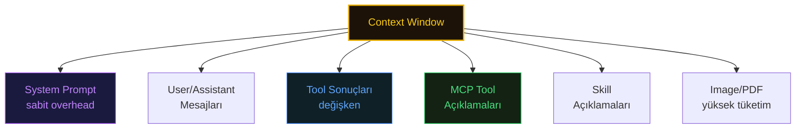
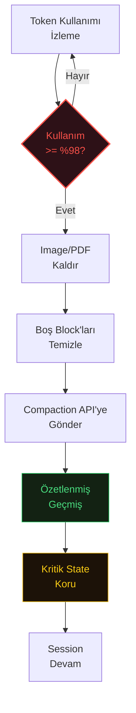

# How Does Memory Work?

Claude Code'un memory sistemi, session'lar arası kalıcı context sağlar. Etkili memory yönetimi, Claude'un projenizi derinlemesine anlaması ile her session'ı sıfırdan başlatması arasındaki farktır.

## CLAUDE.md Hierarchy

| Konum                                                       | Kapsam      | Paylaşımlı       | Kullanım              |
| ----------------------------------------------------------- | ----------- | ---------------- | --------------------- |
| `/Library/Application Support/ClaudeCode/CLAUDE.md` (macOS) | Enterprise  | Tüm kullanıcılar | Şirket standartları   |
| `./CLAUDE.md` veya `./.claude/CLAUDE.md`                    | Proje       | Git ile          | Takım context'i       |
| `~/.claude/CLAUDE.md`                                       | Kullanıcı   | Tüm projeler     | Kişisel tercihler     |
| `./CLAUDE.local.md`                                         | Proje-yerel | Asla             | Kişisel proje notları |

## Effective CLAUDE.md Structure

```Markdown
# Project Context

## Architecture
- Monorepo with packages in /packages
- React frontend in /packages/ui
- Node.js API in /packages/api
- Shared types in /packages/types
- PostgreSQL database via Prisma

## Code Standards
- TypeScript strict mode everywhere
- ESLint + Prettier enforced (pre-commit hooks)
- No default exports
- JSDoc on all public APIs
- Tests required for all new code

## Commands
- `npm test` - Run all tests
- `npm run lint` - Check linting
- `npm run build` - Production build
- `npm run dev` - Start dev servers
- `npm run db:migrate` - Run migrations

## Patterns

### API Endpoints
Create in packages/api/src/routes/
Use Zod for request/response validation
All endpoints need OpenAPI documentation

### React Components
Create in packages/ui/src/components/
Use React Query for server state
Prefer composition over inheritance

### Database
Prisma schema in packages/api/prisma/
Always create migration for schema changes
Use transactions for multi-table operations

## Important Notes
- NEVER commit .env files
- API runs on :3000, UI on :3001
- Feature flags in packages/api/src/flags.ts

## Recent Decisions
- 2025-12-01: Migrated to React Query v5
- 2025-11-15: Adopted Zod for all validation

# Summary Instructions
When using compact, focus on:
- Recent code changes
- Test results
- Architecture decisions made this session
```

> **Kişisel tavsiye:** CLAUDE.md dosyanızı düzenli olarak güncel ve yalın tutmak büyük fark yaratır. Session sonlarında `/claude-md-management:revise-claude-md` ile o session'da öğrenilenleri otomatik olarak CLAUDE.md'ye yazdırın. Belirli aralıklarla `/claude-md-management:claude-md-improver` çalıştırarak tüm CLAUDE.md dosyalarınızı denetleyin, gereksiz maddeleri temizleyin ve kalite raporunu inceleyin. İyi bakılmış bir CLAUDE.md, Claude'un her session'da doğru kararlar almasının temelidir.

## CLAUDE.md Improver ile Kalite Denetimi

`/claude-md-management:claude-md-improver` skill'i CLAUDE.md dosyalarinizi otomatik olarak tarar, puanlar ve iyilestirme onerileri sunar. Ornek bir calisma:

### Ilk Tarama Raporu

```
CLAUDE.md Quality Report

Summary
  Files found: 1
  Files needing update: 1

./CLAUDE.md (Project Root)
  Score: 72/100 (Grade: B)

  Criterion              Score   Notes
  Commands/workflows      5/20   No build/serve/deploy commands documented
  Architecture clarity   18/20   Good structure overview, file roles clear
  Non-obvious patterns   13/15   Emoji ban, Mermaid-only, multi-file update rule documented well
  Conciseness            15/15   Clean, dense, no fluff
  Currency               12/15   Mostly current, TODO list partially stale
  Actionability           9/15   Missing executable commands for common workflows

  Issues:
  - No Jekyll build/serve commands for local development
  - No deployment workflow (push to master = auto deploy?)
  - Missing article creation workflow (what steps to follow when adding a new guide)
  - TODO items could be updated (README is done)

  Recommended additions:
  - Local development commands (Jekyll serve)
  - New article checklist as actionable steps
  - Deployment info (auto-deploy on push to master)
```

### Iyilestirme Sonrasi Yeniden Tarama

Oneriler uygulandiktan sonra ayni skill tekrar calistirildiginda:

```
CLAUDE.md Quality Report (Rerun)

Summary
  Files found: 1
  Average score: 88/100
  Files needing update: 0

./CLAUDE.md (Project Root)
  Score: 88/100 (Grade: B+)

  Criterion              Score   Notes
  Commands/workflows     16/20   Jekyll serve + deploy documented, copy-paste ready
  Architecture clarity   18/20   Structure, Jekyll components, nav files all mapped
  Non-obvious patterns   13/15   Emoji ban, Mermaid-only, multi-file update rule, GPG gotcha
  Conciseness            15/15   Dense, no fluff, every line earns its place
  Currency               13/15   Reflects current state, TODO list clean
  Actionability          13/15   New article checklist actionable, commands ready

  Previous score: 72 -> Current score: 88 (+16)

  No further updates recommended. The file covers all key areas
  for a content-only repo effectively.
```

Bu ornek, skill'in CLAUDE.md'deki eksiklikleri somut kriterlerle olcup hedefli iyilestirmeler onerdigini gostermektedir. Duzenli olarak calistirarak CLAUDE.md kalitenizi yuksek tutabilirsiniz.

## File Imports

CLAUDE.md içinde diğer dosyalara referans verin:

```
See @README.md for project overview
Coding standards: @docs/STYLE_GUIDE.md
API documentation: @docs/API.md
Personal preferences: @~/.claude/preferences.md
```

Import syntax:

* Relative: `@docs/file.md`
* Absolute from project: `@/absolute/path.md`
* Home directory: `@~/.claude/file.md`
* Maksimum derinlik: 5 seviye import

## Memory Rules Directory

Daha organize memory için `.claude/rules/` dizinini kullanın:

```
.claude/rules/
├── testing.md          # Test convention'ları
├── security.md         # Güvenlik gereksinimleri
├── api-patterns.md     # API tasarım pattern'ları
└── deployments.md      # Deployment prosedürleri
```

Rule'lar otomatik yüklenir ve CLAUDE.md'yi karıştırmadan yapılandırılmış context sağlar.

## Quick Memory Addition

Session sırasında `#` prefix'i ile not ekleyin:

```
# Always run tests before committing
# The payment module is especially fragile
# Use the new logger from packages/api/src/logger.ts
```

Notun hangi memory dosyasına kaydedileceğini seçmeniz istenir.

## Auto Memory

Claude Code artık session'lar arası proje context'ini otomatik kaydeder ve hatırlar. Çalışırken Claude; pattern'lar, convention'lar, debugging insight'ları ve önemli dosya yollarını kalıcı memory dosyasına yazar:

```
~/.claude/projects/{project-path}/memory/MEMORY.md
```

Session başlangıcında `Recalled memories`, session sırasında `Wrote memories` görürsünüz.

**Auto Memory vs # Prefix:**

|               | Auto Memory                                          | # Prefix                                  |
| ------------- | ---------------------------------------------------- | ----------------------------------------- |
| **Tetikleme** | Claude örtük olarak karar verir                      | Siz açıkça karar verirsiniz               |
| **İçerik**    | Pattern'lar, convention'lar, mimari                  | Spesifik gerçekler veya talimatlar        |
| **Depolama**  | MEMORY.md (otomatik yönetilen)                       | Kullanıcı seçtiği memory dosyası          |
| **Düzenleme** | Claude yönetir; dosyayı doğrudan düzenleyebilirsiniz | Neyin saklanacağını siz kontrol edersiniz |

Auto memory her zaman system prompt'a yüklenir (ilk 200 satır). Kısa tutun detaylı notlar için MEMORY.md'den bağlantılı ayrı konu dosyaları oluşturun (ör. `debugging.md`, `patterns.md`).

**Memory yönetimi :** `/memory` ile auto-memory dosyalarını doğrudan Claude Code içinden görüntüleyin ve yönetin.

**Memory timestamp'leri (v2.1.75+):** Memory dosyaları artık son değiştirilme tarihini içerir. Claude hangi memory'lerin güncel, hangilerinin eski olduğunu anlayarak auto-recall sırasında context kalitesini artırır.

Devre dışı bırakmak için başlangıçta `--no-memory` kullanın (CLAUDE.md dahil tüm memory'yi devre dışı bırakır).

## Context Window Architecture

Context window, Claude Code'un çalışma belleğidir. Her mesaj, dosya okuma, tool çıktısı ve yanıt bu pencereden token tüketir.

### Effective Window Hesaplama

```
Total Model Context Window (200K veya 1M)
    - Reserved Output Tokens (ör. Sonnet 128K)
    = Effective Context Budget
```

### Context Dağılımı



| Component                | Token Etkisi           | Not                                          |
| ------------------------ | ---------------------- | -------------------------------------------- |
| System Prompt            | Sabit overhead         | Cache verimliliği için optimize edilmiş      |
| User/Assistant Mesajları | Değişken               | Text ve ekler dahil                          |
| Tool Sonuçları           | Değişken               | Büyük çıktılar diske yazılır, referans döner |
| MCP Tool Açıklamaları    | Server sayısıyla artar | %10 eşiğini aşınca otomatik defer edilir     |
| Skill Açıklamaları       | Context'in %2'si       | Model'in context window boyutuyla oranlanır  |
| Image/PDF                | Yüksek                 | Boyut limitleri uygulanır                    |

### Auto-Compaction

Context window \~%98 dolduğunda otomatik compaction tetiklenir:



### Compaction Sırasında Korunan State

* Session isimleri (custom title'lar)
* Plan Mode durumu (planlama vs implementation)
* Subagent mesaj geçmişi (büyük session hataları önlemek için trimlenmiş)
* Configuration state ve custom settings

### Tool Output Yönetimi

| Çıktı Tipi         | Yönetim                                   |
| ------------------ | ----------------------------------------- |
| Standard           | `tool_result` içinde inline               |
| Büyük (eşiği aşan) | Temp dosyaya kaydet, model'e referans dön |
| PDF (10+ sayfa)    | Hafif referans olarak dön                 |

### MCP & Skill Context Limitleri //todo: ref ver

* **MCP Auto-Defer:** Tool açıklamaları context'in %10'unu aştığında defer edilir. Keşif `MCPSearch` tool'u üzerinden yönlendirilir.
* **Skill Budget:** Skill açıklamaları context window'un %2'si ile sınırlıdır. Model'in window boyutuyla oranlanır.

> **Kaynak:** [DeepWiki - Context Window and Compaction](https://deepwiki.com/anthropics/claude-code/3.3-context-window-and-compaction)

## Context Management Commands

**Context kullanımını görüntüle:**

```
> /context
```

System prompt, konuşma, tool'lar ve dosya içerikleri arasında context dağılımının görsel grid'ini gösterir.

**Konuşmayı compact'la:**

```
> /compact
> /compact focus on the authentication changes
> /compact preserve test output and error messages
```

Eski konuşmayı akıllıca özetlerken önemli bilgiyi korur.

**CLAUDE.md'de custom compaction talimatları:**

```Markdown
# Summary Instructions
When using compact, focus on:
- Test output and failures
- Code changes made this session
- Architecture decisions
```

**Extended thinking:**

```Shell
export MAX_THINKING_TOKENS=10000
```

Daha fazla thinking token = daha fazla muhakeme kapasitesi ama daha yüksek maliyet.

## Context Optimization Strategies

* Claude'a arama yaptırmak yerine spesifik dosya referansları kullanın
* Görevler arasında `/clear` ile alakasız konuşmaları temizleyin
* Uzun session'larda proaktif olarak `/compact` kullanın
* Keşif işlerini izole etmek için subagent kullanın
* Karmaşık görevleri odaklanmış etkileşimlere bölün
* Devam eden iş için tekrar açıklamak yerine session'ları resume edin

