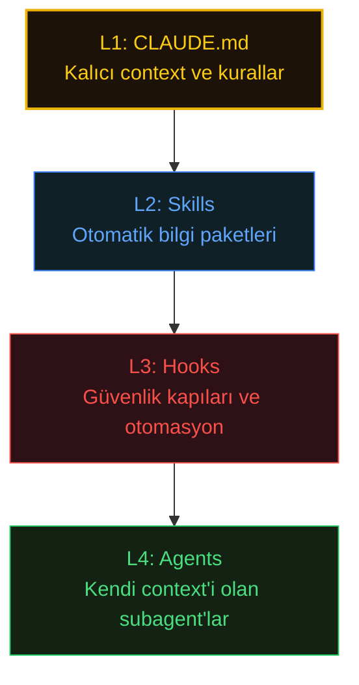

# Best Practices

## Projenizi 4 Katmanda Yapılandırın

Claude Code'un system mimarisi 3 katmanlıdır (Core/Delegation/Extension - bkz. [01](01-Claude-Code-Complete-Guide.md#three-layer-mental-model)). Ancak **kullanıcı olarak projenizi yapılandırırken** 4 katmanlı bir yaklaşım en etkili sonucu verir:



| Katman | Ne | Neden | Rehber |
|--------|-----|-------|--------|
| **L1 - CLAUDE.md** | Proje context'i, kurallar, komutlar | Claude'un her session'da projeyi anlamasının temeli | [09 - Memory](09-How-Does-Memory-Work.md) |
| **L2 - Skills** | Domain uzmanlığı (güvenlik, test, React patterns) | Context'e göre otomatik aktifleşir, tekrarı önler | [07 - Skills](07-How-Do-Skills-Work.md) |
| **L3 - Hooks** | Formatter, linter, test, erişim engeli | Model davranışından bağımsız garanti çalışma | [04 - Hooks](04-How-To-Hooks-Work.md) |
| **L4 - Agents** | Keşif, planlama, paralel implementation | İzole context ile büyük görevleri parçala | [06 - Subagents](06-What-are-Subagents.md) |

**Pratik kural:** Önce L1'i sağlam kurun (iyi bir CLAUDE.md). Sonra L3 ile deterministik güvenceleri ekleyin (hook'lar). Ardından L2 ile tekrar eden bilgiyi skill'lere dönüştürün. Son olarak L4 ile büyük görevleri paralelize edin.

## Session Strategy

Session'ları `/rename` ile isimlendirin, sonra isimle resume edin:

```Shell
# Session içinde isimlendir:
> /rename feature-auth

# Daha sonra isimle devam et:
claude --resume "feature-auth"

# Veya en son session'a devam et:
claude -c
```

Devam eden iş için context'i tekrar açıklamak yerine session'ları resume edin.

## CLAUDE.md Design

* **Taranabilir tut.** Claude bunu her session'da okur, yoğun paragraflar context israfıdır.
* **Aşikar olmayanı belgele.** Projeye özgü pattern'lar, alışılmadık convention'lar, kararlar. Claude'un koddan çıkarabileceğini atla.
* **Sürekli güncelle.** Geliştirme sırasında `#` ile not ekle. Haftalık gözden geçir ve birleştir.
* **Komut referansı ekle.** Sürekli çalıştırdığın komutları belgele.

## Security: Untrusted Repositories

> **Uyarı:** Güvenilmeyen repository'lerde Claude Code çalıştırırken `CLAUDE.md` dosyaları, `.claude/settings.json` ve hook script'lerinin okunup potansiyel olarak çalıştırıldığını bilin. Kötü niyetli repo'lar bunları prompt enjeksiyonu, izin override'ı veya rastgele komut çalıştırma için kullanabilir. Sahip olmadığınız repo'larda Claude Code çalıştırmadan önce her zaman `CLAUDE.md`, `.claude/settings.json` ve hook script'lerini inceleyin. `--dangerously-skip-permissions` sadece güvenilir codebase'lerde kullanın.

## Custom Commands

Tekrarlayan workflow'lar için command oluşturun:

```YAML
---
description: Start new feature
allowed-tools: Bash(git:*), Read, Edit
---

1. Create branch: !`git checkout -b feature/$ARGUMENTS`
2. Pull latest main
3. Set up boilerplate
4. Begin implementation
```

## Effective Prompting

**Spesifik olun:**

```
# İyi
"LoginForm'a email validation ekle, src/components/LoginForm.tsx"

# Çok belirsiz
"Login'i iyileştir"
```

**Dosyalara doğrudan referans verin:**

```
"@src/auth/middleware.ts dosyasını güvenlik sorunları için incele"
```

**Kısıtlama verin:**

```
"@src/repositories/UserRepository.ts ile aynı pattern'ı kullanarak refactor et"
```

**Keşif için subagent kullanın:**

```
"Explore agent ile hata yönetimi yaptığımız tüm yerleri bul"
```

