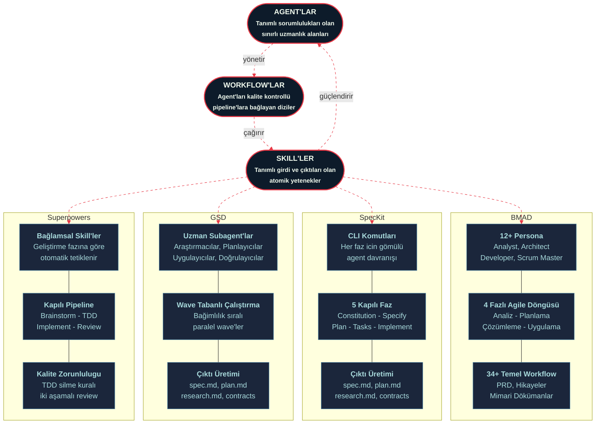
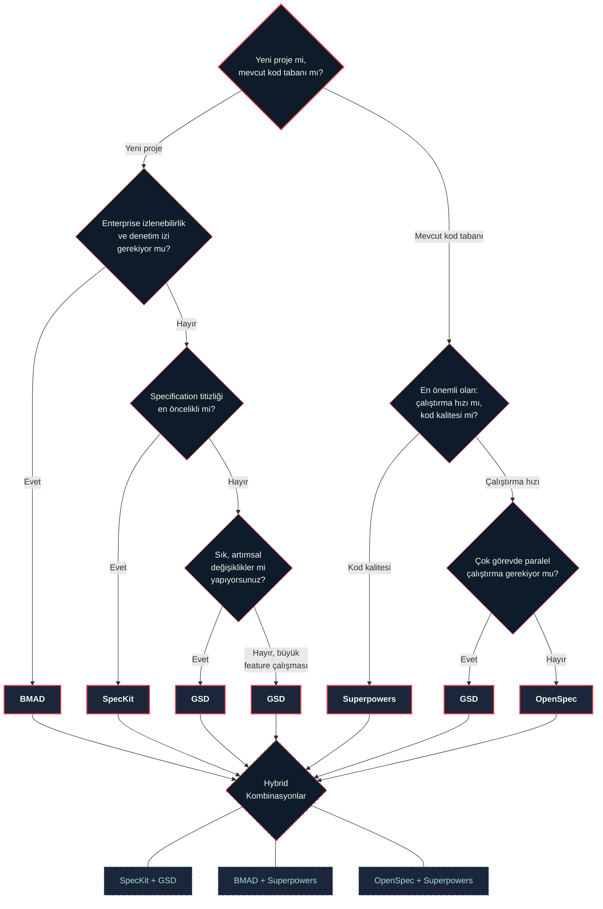

# Agentic Coding Frameworks

## Agentic Coding Framework Nedir?

Agentic coding framework, AI coding assistant'ları (Claude Code, Cursor, Copilot vb.) yapılandırılmamış "vibe coding"den disiplinli bir geliştirme sürecine taşıyan yöntem ve kural setleridir. Bu framework'ler, AI'a ne yapacağını adım adım söylemek yerine; roller, fazlar, gate'ler ve specification'lar tanımlayarak AI'ın otonom ama kontrollü çalışmasını sağlar.

Geleneksel yaklaşımda geliştirici prompt yazar, AI kod üretir, geliştirici review eder. Agentic framework'lerde ise AI bir takım gibi davranır: analiz yapar, plan oluşturur, specification yazar, implement eder ve kendi kendini doğrular.

## Ihtiyac Nereden Cikti?

AI coding tool'ları giderek daha yetenekli hale geldikce, "vibe coding" problemi büyüdü:

* **Tekrarlanabilirlik sorunu**: Aynı prompt, farklı session'larda farklı sonuçlar üretilmesi problemi
* **Context kaybı**: Uzun session'larda AI önceki kararları unutur, tutarsız kod üretir.  Kodun okunaklığı veya tüm kod yapısında düzen bozulmasına sebebiyet verir.
* **Specification eksikliği**: Geliştirici kafasındaki tasarımı AI'a aktaramaz, sonuç beklentiden sapar.  Hepimizin çok sık karşılaştığı, talep edilen ister ile üretilen arasındaki fark (analiz gap) sonucudur. Bu gerçek hala devam etmektedir.
* **Review darboğazı**: AI hızlı kod üretir ama review edilmemiş kod teknik borç biriktiriyor. Tamamen AI ile vibe coding yaptırılarak yazılan bir proje için destek istendi. 4M satır kod üretmiş. Yukarıdaki tüm problemlere referans ve örnekti.  Agentic framework kullanılmamasının bir sonucu.
* **Koordinasyon zorluğu**: Birden fazla AI session'ı aynı proje üzerinde çalıştığında conflict ve tutarsızlık oluşuyor. (Yine bütünlük problemi ana sebep)

Enterprise projelerde bu sorunlar katlanarak büyüyor. Bir startup'ta "hızlı ve kırılgan" kabul edilebilirken, 50+ kişilik bir takımda AI'ın ürettiği her satır kodun izlenebilir, tekrarlanabilir ve review edilmiş olması gerekiyor.

## Neden Kullanmalıyız?

| Sorun             | Framework Olmadan                         | Framework ile                            |
| ----------------- | ----------------------------------------- | ---------------------------------------- |
| Tutarlılık        | Her session sıfırdan başlar               | Roller ve kurallar kalıcı                |
| Kalite            | Review sonrası düzeltme                   | Gate'ler ile önleme                      |
| Ölçeklenebilirlik | Tek geliştirici, tek session              | Paralel agent'lar, takım simülasyonu     |
| Izlenebilirlik    | Prompt history kaybolur                   | Specification ve plan dokümanları kalıcı |
| Onboarding        | Her geliştirici kendi yöntemini icat eder | Standart workflow tüm takım için geçerli |

Framework kullanmanın temel faydası: **AI'ı bir araçtan bir takım üyesine dönüştürmek.** Araç kullanırsınız; takım üyesiyle işbirliği yaparsınız.

***

## The Shared Triad: Agent, Workflow, Skill

Framework'ler arasındaki farklara dalmadan once, ortak noktalarını görmek gerekir. Felsefi olarak ne kadar ayrışsalar da, bu karşılaştırmadaki her framework zekasını aynı üç temel yapı taşı üzerine kurar.

**Agent'lar**, sistemin üstlendigi persona veya rollerdir. BMAD bunlara persona der (Analyst, Architect, Developer). GSD subagent olarak adlandırır (researcher, planner, executor). Superpowers bunları contextual olarak tetiklenen skill'ler (bazen gate olarak da anılır) olarak tanımlar. SpecKit ise agent davranışını CLI komutlarına gömmüştür. Terminoloji değişir ama konsept aynıdır: tanımlı sorumlulukları olan, sınırları belirlenmiş bir uzmanlık alanı olarak belirlenir.&#x20;

**Workflow'lar**, agent'ları pipeline'lara bağlayan dizilerdir. BMAD dört fazlı agile döngüsü kullanır. SpecKit explicit checkpoint'ler ile gated faz'ları zorunlu kılar. GSD execution'ı dependency-ordered wave'ler halinde organize eder. Superpowers skill'leri brainstorming'den code review'a kadar otomatik bir pipeline'a zincirleyerek çalıştır. Her framework, yapılandırılmamış prompting'in kalitesiz sonuç ürettiği konusunda hemfikir; anlaşmazlık ne kadar yapının yeterli olduğuna bağlıdır. (Zayıf promting kaynaklı)

**Skill'ler**, agent'ların gerçekleştirdiği atomik yeteneklerdir. PRD yazmak. Test çalıştırmak. Diagram üretmek. Kod review etmek. Dependency'leri parse etmek. Her framework farklı skill'ler içerir ama soyutlama aynıdır: tanımlı girdi ve çıktıları olan, yeniden kullanılabilir bir iş birimi olşuturur.

Aşağıdaki diyagram, her framework'un bu ortak triad'ı nasıl farklı uyguladığını gosterir:

## Framework Karşılaştırması

Beş agentic coding framework toplamda 200K+ GitHub star'a sahip ve her biri vibe coding'i disiplinli AI-assisted development ile değiştirmeyi vaat ediyor.&#x20;

Bu karşılaştırma; BMAD'ın enterprise takım simülasyonunu, SpecKit'in gated specification sürecini, OpenSpec'in brownfield-first delta spec yaklaşımını, GSD'nin context-isolating wave parallelism'ini ve Superpowers'ın TDD-enforced disiplin sistemini inceliyor.

| Framework                        | Odak                                                           | Detay      |
| -------------------------------- | -------------------------------------------------------------- | ---------- |
| [BMAD](99-BMAD-Method.md)        | Enterprise takım simülasyonu, 12+ persona, documentation-first | 40.2k star |
| [SpecKit](98-SpecKit.md)         | Gated specification process, 5 fazlı katı workflow             | 75.9k star |
| [OpenSpec](97-OpenSpec.md)       | Brownfield-first, delta spec'ler, hafif overhead               | 29.5k star |
| [GSD](96-GSD.md)                 | Context isolation, wave parallelism, multi-agent orkestra      | 28.1k star |
| [Superpowers](95-Superpowers.md) | TDD-enforced disiplin, iki aşamalı review, brainstorming gate  | Growing    |

## Choosing Your Framework: A Decision Matrix

> Hiçbir framework evrensel olarak en iyisi değildir. Doğru seçim takım büyüklüğünüze, proje tipinize, kalite gereksinimlerinize ve seremoni toleransınıza bağlıdır. AI assistant alışkanlıkları, ekibinizin ve sizin iş yapış yöntemlerinize göre değişiklik göstermektedir.

| Faktör                   | BMAD                                          | SpecKit                                             | OpenSpec                                     | GSD                                             | Superpowers                               |
| ------------------------ | --------------------------------------------- | --------------------------------------------------- | -------------------------------------------- | ----------------------------------------------- | ----------------------------------------- |
| **En uygun**             | İzlenebilirlik gerektiren enterprise takımlar | Specification titizliği gereken greenfield projeler | Mevcut kod tabanlarında brownfield iterasyon | Paralel çalıştırma gerektiren büyük feature'lar | Kod kalitesini hızdan önce tutan takımlar |
| **Takım büyüklüğü**      | 3+ geliştirici                                | Herhangi                                            | Herhangi                                     | Solo - küçük takımlar                           | Solo - küçük takımlar                     |
| **Proje tipi**           | Compliance ihtiyaçlı yeni sistemler           | Net gereksinimleri olan yeni sistemler              | Artımsal değişiklik gereken mevcut sistemler | Çok bağımsız görevli karmaşık feature'lar       | TDD disiplininin önemli olduğu her proje  |
| **Öğrenme eğrisi**       | Dik (12+ persona, 34+ workflow)               | Orta (5 kapılı faz)                                 | Düşük (esnek, minimal seremoni)              | Orta (wave modeli, multi-agent kavramları)      | Düşük (skill'ler otomatik aktive olur)    |
| **Seremoni overhead'i**  | Yüksek                                        | Yüksek (feature başına 1-3+ saat)                   | Düşük (değişiklik başına \~250 satır)        | Orta (ön yatırım, çalıştırmada zaman kazanır)   | Orta (brainstorming + TDD ön zaman ekler) |
| **Çalıştırma derinliği** | Dokümantasyon odaklı                          | Bağlı agent'a delege eder                           | Bağlı agent'a delege eder                    | Paralelizmli tam orkestrasyon                   | Kalite gate'li tam orkestrasyon           |
| **Context yönetimi**     | Dosya tabanlı artifact'lar                    | Yapılandırılmış spec artifact'ları                  | Değişiklik izolasyon klasörleri              | Görev başına taze context (200k token)          | Taze context'li subagent dispatch         |
| **Platform desteği**     | Claude Code + custom prompt araçları          | 20+ agent                                           | 20+ agent                                    | Claude Code, OpenCode, Gemini CLI               | Claude Code + uyumlu agent'lar            |
| **GitHub Stars**         | 40.2k                                         | 75.9k                                               | 29.5k                                        | 28.1k                                           | 30K+ ve Mart'ın en hızlı büyüyen repo'su  |
| **Test zorunluluğu**     | Önerilen                                      | Checklist tabanlı                                   | Doğrulama fazı                               | Hedefe geriye dönük doğrulama                   | Silme kuralıyla zorunlu TDD               |
| **Statik spec riski**    | Düşük (canlı dokümanlar)                      | Yüksek (spec sapması)                               | Yüksek (spec sapması)                        | Düşük (çalıştırma odaklı)                       | Düşük (brainstorm kodu bilgilendirir)     |
| **Token verimliliği**    | Orta(Hafif Zayıf)                             | Düşük (ağır artifact'lar)                           | Yüksek (minimal çıktı)                       | Düşük (taze context'ler)                        | Orta (subagent dispatch)                  |
| **Brownfield desteği**   | Orta                                          | Zayıf                                               | Güçlü                                        | Güçlü                                           | Orta                                      |

## Hangi Framework'ü Kullanmalısınız?

## Quick Decision Guide

**BMAD'ı seçin**; birden fazla paydaşı olan enterprise yazılım geliştiriyorsanız, denetim izlerine ihtiyacınız varsa ve rol bazlı organizasyondan faydalanacak büyüklükte bir takımınız varsa. Overhead, compliance ve devir teslim dokümantasyonu gerçek gereksinimler olduğunda size avantaj sağlar.&#x20;

**SpecKit'i seçin**;sıfırdan yeni bir proje başlatıyorsanız ve mevcut en titiz specification sürecini istiyorsanız. Kapılı fazlar erken implementation'ı önler ve 20+ agent desteği sizi tek bir AI aracına kilitlemez. Artifact üretimindeki zaman yatırımını yeniden çalışmaya karşı garanti olarak kabul edebilirsiniz.

**OpenSpec'i seçin**; mevcut bir kod tabanı (yada brownfield proje) üzerinde çalışıyorsanız ve devam eden değişiklikler için hafif, iteratif specification gerekiyorsa. Delta marker sistemi ve düşük seremoni günlük kullanım için pratiktir. Yeni bir sistem için kapsamlı mimari dokümantasyon gerekiyorsa atlayın.

**GSD'yi seçin**; paralel çalıştırmadan faydalanan çok bağımsız bileşenli karmaşık feature'lar geliştiriyorsanız. Context izolasyon mimarisi uzun geliştirme session'ları için gerçekten üstündür. Düzinelerce görev boyunca tutarlı kalitenin bedeli olarak yüksek token maliyetini kabul edin. Ayrıca GSD mevcut kod tabanları için mükemmel desteğe sahiptir ve brownfield projeleri desteklemede uzmandır.

> **Not:** Birçok kategoride başka bir araç bir şeyde en iyiyse, GSD her zaman ikinci en iyidir. Hızlıca bir tane seçmeniz gerekiyorsa, başlamanız gereken GSD'dir.

**Superpowers'ı seçin**; kod kalitesi birincil endişenizse ve test edilmiş, review edilmiş ve disiplinli çıktı karşılığında daha yavaş hızı kabul etmeye istekliyseniz. Zorunlu brainstorming ve TDD dayatması bu karşılaştırmadaki herhangi bir framework'ün en güvenilir kodunu üretir, ancak her göreve zaman ekler.

## Benim Tercihim

Eğer yeni bir proje yapacaksam **BMAD Method** ile başlıyorum: research, brainstorming, project-brief, mimari, test mimarisi ve PRD adımlarıyla planlama aşamasına kadar tüm artifact'ları oluşturuyorum. Sonrasında **Superpowers** ile TDD yöntemiyle teknik implementation ve BRD'leri geliştiriyorum.

Superpowers'ın kod kalitesi ve code review aşamaları çok daha güvenli ve Spec Driven Development prensiplerine sadık kalmanızı zorluyor. Yaklaşımındaki disiplini seviyorum.

Yukarıdaki karar grafiğindeki hybrid seçimleri tercih edebilirsiniz. Unutmayın: hiçbir framework tüm problemi çözmüyor. Her şey trade-off. Hiçbir SDD framework silver bullet değildir.

Örnek bir BMAD ve Superpowers uyguladığım proje artifact'larını buradan inceleyebilirsiniz:

* **BMAD ile gerçekleşen conversation'lar:** [bmad-conversation-sessions](https://github.com/alperhankendi/Ctxo/tree/master/docs/bmad-conversation-sessions)
* **Framework'ün ürettiği artifact'lar:** [artifacts](https://github.com/alperhankendi/Ctxo/tree/master/docs/artifacts)
