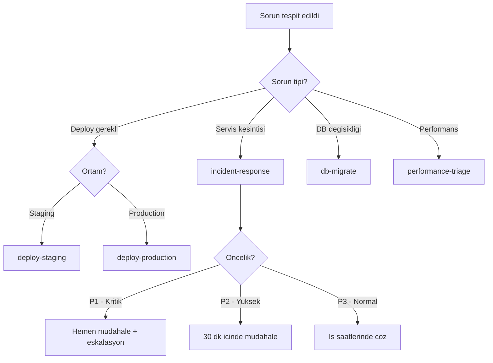

# Runbooks

Runbook, operasyonel bir süreci adım adım anlatan dokümandır. Claude Code ile runbook'lar oluşturabilir, yönetebilir ve otomatize edebilirsiniz. Bu makalede runbook kavramını, Claude Code ile nasıl entegre çalıştığını ve pratik örnekleri inceliyoruz.


> Development aşamsında sürekli yaptığınız işleri tekrar tekrar Claude Code söylemektense çalıştığınız bir süreci örneğin; database resetle, service restart et, n,y,z dosyalarını sil, etc
> adımları komut haline çevrilmesi işlemi.

> Active çalıştığınız claude code conversation ını "şimdi bunu runbook çevir ve kaydet" şeklinde
> çalıştığınız bir session çevirilmesi çok pratik oluyor.
>
> Örneğin sık sık çalıştırdığım ve CC conversation'dan extract ettiğim bir runbook örneği: [MCP Validation Runbook](samples/runbook/mcp-validation/mcp-validation.md)

## Runbook Nedir?

Runbook, belirli bir görevi (deploy, incident response, bakım, migration) her seferinde aynı şekilde yapılmasını sağlayan adım adım rehberdir. Temel amacı:

* **Tekrarlanabilirlik**: Süreci her seferinde tutarlı bir şekilde yürütme
* **Bilgi transferi**: Tek kişiye bağımlılık yerine herkesin takip edebileceği adımlar
* **Hata azaltma**: Kritik adımların atlanmasını önleme
* **Hız**: Özellikle incident/outage sırasında hızlı aksiyon alma

## Runbook Anatomisi

İyi bir runbook şu bölümlerden oluşur:

```
1. Başlık ve Amaç         -- Bu runbook ne zaman, neden kullanılır?
2. Ön Koşullar             -- Gerekli erişim, araçlar, yetkiler
3. Adım Adım Talimatlar   -- Komutlar, kontroller, beklenen çıktılar
4. Doğrulama Adımları     -- Her adımdan sonra "ne görmeli?" kontrolü
5. Rollback Planı          -- Bir şey ters giderse ne yapılır?
6. Eskalasyon              -- Kim aranır, hangi kanal kullanılır?
```

## Claude Code ile Runbook Kullanımı

Claude Code'un custom command ve skill yapısından faydalanarak runbook'ları çalıştırılabilir hale getirebilirsiniz.

### 1. Runbook'u Command Olarak Tanımlama

`.claude/commands/` altına runbook'u bir command olarak yerleştirebilirsiniz:

```Markdown
<!-- .claude/commands/deploy-production.md -->

# Production Deploy Runbook

Bu runbook production deploy sürecini adım adım yönetir.

## Ön Koşullar
- master branch'te olun
- Tüm testler geçmiş olmalı
- Staging ortamı doğrulanmış olmalı

## Adımlar

1. Branch durumunu kontrol et:
   - `git status` ile temiz working tree doğrula
   - `git log --oneline -5` ile son commit'leri incele

2. Test suite'i çalıştır:
   - `npm test` veya proje test komutu
   - Başarısız test varsa DURMA, sorunu çöz

3. Build oluştur:
   - `npm run build` veya proje build komutu
   - Build artifact'larını doğrula

4. Deploy et:
   - $ARGUMENTS (örneğin: staging, production)
   - Deploy sonrası health check yap

5. Doğrulama:
   - Endpoint'leri kontrol et
   - Log'larda hata olmadığını doğrula
   - Monitoring dashboard'u incele
```

Kullanım:

```Shell
# Claude Code'da
/deploy-production production
```

### 2. Incident Response Runbook

```Markdown
<!-- .claude/commands/incident-response.md -->

# Incident Response Runbook

Servis kesintisi veya performans sorunu tespit edildiğinde bu runbook'u çalıştır.

## Öncelik: $ARGUMENTS

## Adımlar

1. Mevcut durumu analiz et:
   - Hangi servisler etkilenmiş?
   - Hata loglarına bak
   - Son deploy ne zaman yapıldı?

2. Etkiyi belirle:
   - Kaç kullanıcı etkileniyor?
   - Veri kaybı var mı?

3. Hızlı müdahale:
   - Son deploy'u rollback edebilir miyiz?
   - Feature flag ile devre dışı bırakabilir miyiz?
   - Scaling ile hafifletebilir miyiz?

4. Kök neden analizi:
   - Son commit'leri incele: `git log --since="2 hours ago" --oneline`
   - İlgili config değişikliklerini kontrol et
   - Dependency güncellemelerini göz at

5. Çözüm sonrası:
   - Post-mortem dokümanı oluştur
   - Önleyici aksiyonları tanımla
```

### 3. Database Migration Runbook

```Markdown
<!-- .claude/commands/db-migrate.md -->

# Database Migration Runbook

## Ön Koşullar
- Veritabanı yedeği alınmış olmalı
- Bakım penceresi onaylanmış olmalı
- Rollback script'i hazır olmalı

## Adımlar

1. Yedek al:
   - `pg_dump` veya ilgili yedekleme komutu
   - Yedek dosyasının boyutunu ve bütünlüğünü doğrula

2. Migration'ı staging'de test et:
   - Migration script'ini staging'de çalıştır
   - Veri tutarlılığını kontrol et
   - Uygulama testlerini çalıştır

3. Production migration:
   - Bakım moduna al (gerekiyorsa)
   - Migration script'ini çalıştır
   - Her adımdan sonra veri doğrula

4. Doğrulama:
   - Uygulama normal çalışıyor mu?
   - Veri tutarlılığı sağlanmış mı?
   - Performans metrikleri normal mi?

5. Rollback (gerekirse):
   - Rollback script'ini çalıştır
   - Yedekten geri yükle
   - Uygulama durumunu doğrula
```

## Runbook + Hooks Entegrasyonu

Runbook adımlarını hook'larla otomatize edebilirsiniz:

```JSON
{
  "hooks": {
    "PreToolUse": [
      {
        "matcher": "Bash",
        "hooks": [
          {
            "type": "command",
            "command": "echo 'Runbook step executing: checking prerequisites...'"
          }
        ]
      }
    ],
    "PostToolUse": [
      {
        "matcher": "Bash",
        "hooks": [
          {
            "type": "command",
            "command": ".claude/hooks/validate-runbook-step.sh"
          }
        ]
      }
    ]
  }
}
```

## Runbook + CI/CD Entegrasyonu

Runbook'ları CI/CD pipeline'ında `claude -p` ile çalıştırabilirsiniz:

```YAML
name: Deploy with Runbook
on:
  workflow_dispatch:
    inputs:
      environment:
        description: "Hedef ortam"
        required: true
        type: choice
        options:
          - staging
          - production

jobs:
  deploy:
    runs-on: ubuntu-latest
    steps:
      - uses: actions/checkout@v4
      - uses: anthropics/claude-code-action@v1
        with:
          anthropic_api_key: ${{ secrets.ANTHROPIC_API_KEY }}
          prompt: "/deploy-production ${{ inputs.environment }}"
          claude_args: "--max-turns 20"
```

## Runbook Karar Ağacı

Hangi runbook'u ne zaman kullanasınız:



## Runbook Best Practices

| Kural               | Açıklama                                                |
| ------------------- | ------------------------------------------------------- |
| Atomik adımlar      | Her adım tek bir iş yapsın, doğrulanabilir olsun        |
| Copy-paste komutlar | Komutlar doğrudan kopyalanıp çalıştırılabilir olmalı    |
| Beklenen çıktı      | Her adımdan sonra "bunu görmeli" bilgisi ekleyin        |
| Rollback her adımda | Sadece sonda değil, her kritik adımda rollback planı    |
| Versiyon kontrolü   | Runbook'ları repo'da tutun, değişiklikleri PR ile yapın |
| Düzenli review      | Her incident sonrası runbook'u güncelleyin              |
| DRY değil, açık     | Runbook'larda tekrar sorun değil, netlik öncelik        |

## Örnek: Tam Bir Production Deploy Runbook

Aşağıda gerçek bir senaryoya yakın, tam bir runbook örneği:

```Markdown
# Production Deploy Runbook v2.1

## Amaç
Ana uygulamayı production ortamına deploy etmek.

## Ön Koşullar
- [ ] master branch'te ve güncel (`git pull origin master`)
- [ ] Tüm CI kontrolleri geçmiş (GitHub Actions yeşil)
- [ ] Staging'de QA onay almış
- [ ] Deploy penceresi: Hafta içi 10:00-16:00 (Cuma hariç)

## Adım 1: Ortam Kontrolü
Komutu çalıştır ve çıktıyı doğrula:
  git status
  # Beklenen: "nothing to commit, working tree clean"

  git log --oneline -3
  # Beklenen: Son commit deploy edilecek değişikliği içermeli

## Adım 2: Son Test
  npm run test:ci
  # Beklenen: All tests passed

  npm run build
  # Beklenen: Build successful, no warnings

## Adım 3: Yedekleme
  ./scripts/backup-db.sh production
  # Beklenen: "Backup completed: backup-YYYY-MM-DD-HHMMSS.sql.gz"
  # Yedek dosya boyutunu kontrol et (önceki yedeklerle karşılaştır)

## Adım 4: Deploy
  ./scripts/deploy.sh production
  # Beklenen: "Deploy successful" mesajı
  # Hata alınırsa: ADIM 7'ye (Rollback) git

## Adım 5: Doğrulama
  curl -s https://api.example.com/health | jq .
  # Beklenen: {"status": "ok", "version": "X.Y.Z"}

  # Monitoring dashboard kontrolü (5 dakika bekle):
  # - Error rate < %0.1
  # - Response time < 200ms (p99)
  # - CPU/Memory normal aralıklarda

## Adım 6: Tamamlama
  # Slack'te #deployments kanalına bildirim at
  # Deploy log'unu güncelle

## Adım 7: Rollback (Gerekirse)
  ./scripts/rollback.sh production
  # Beklenen: "Rollback to previous version completed"

  # Rollback sonrası doğrulama:
  curl -s https://api.example.com/health | jq .
  # Beklenen: Önceki versiyon numarası

## Eskalasyon
| Durum | Kişi | Kanal |
|-------|------|-------|
| Deploy başarısız | DevOps on-call | #ops-escalation |
| Rollback başarısız | Platform Lead | Telefon |
| Veri sorunu | DB Admin | #db-support |
```

## Claude Code Runbook Oluşturma İpuçları

Claude Code'dan runbook oluşturmasını isterken şu prompt yaklaşımlarını kullanın:

```Shell
# Mevcut script'ten runbook oluşturma
claude "scripts/deploy.sh dosyasını analiz et ve
  adım adım bir deploy runbook'u oluştur.
  Her adımda beklenen çıktıyı ve hata durumunu belirt."

# Incident'tan runbook oluşturma
claude "Bu incident post-mortem'i oku ve
  aynı sorunun tekrarında kullanılacak bir
  incident response runbook'u oluştur."

# Mevcut runbook'u iyileştirme
claude "Bu runbook'u incele:
  - Eksik doğrulama adımları var mı?
  - Rollback planı yeterli mi?
  - Eskalasyon yolu tanımlanmış mı?"
```

> **Önemli:** Runbook, otomasyon değil, otomasyon öncesi adımdır. Bir runbook'un adımları yeterince olgunlaştıysa, onu bir script veya CI/CD pipeline'ına dönüştürmeyi düşünün. Ancak tamamen otomatize edemediğiniz süreçler (karar noktaları, insan onayları) için runbook vazgeçilmezdir.

> **Kaynaklar:**
>
> * [Claude Code Commands Docs](https://code.claude.com/docs)
> * [PagerDuty Runbook Best Practices](https://www.pagerduty.com/resources/learn/what-is-a-runbook/)
> * [Google SRE Book - Emergency Response](https://sre.google/sre-book/emergency-response/)

