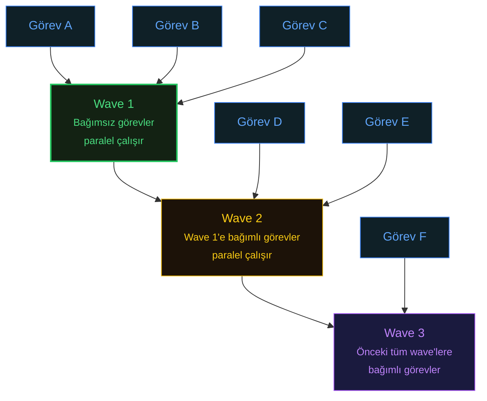

# GSD (Get "Stuff" Done) - The Context Engineering Powerhouse

GitHub Stars: 28.1k | License: MIT | Latest: Active development (March 2026) | [GitHub](https://github.com/gsd-framework/gsd) | [Site](https://gsd.dev)

GSD, specification odaklı framework'lerin büyük ölçüde görmezden geldiği bir probleme saldırır: AI agent'ınızın context window'u dolduğunda ve çıktı kalitesi çöktüğünde ne olur?

## Context Rot Problemi

Context rot, bir AI modelinin tek bir session içinde daha fazla token işledikçe yaşadığı kalite bozulmasıdır. Araştırma ve pratik deneyimler öngörülebilir bir düşüş eğrisi ortaya koyar:

| Context Kullanımı | Kalite Durumu |
| --- | --- |
| **%0-30** | Zirve performans |
| **%50+** | Acele etme, detay atlama, kestirmeler |
| **%70+** | Halüsinasyonlar artışı |
| **%80+** | Konuşmanın başında belirlenen gereksinimleri unutma |

Bu teorik bir endişe değildir. Tek bir Claude Code session'ında karmaşık bir feature üzerinde çalışmış herhangi bir geliştirici, uzun konuşma sonrasında modelin çıktı kalitesinin gözle görülür şekilde bozulduğunu deneyimlemiştir. Yirminci dosya düzenlemesi, ikincisinden ölçülebilir şekilde daha kötüdür.

## GSD Bunu Nasıl Çözer?

GSD'nin temel mimari kararı, her çalıştırma birimi için **taze subagent context'leri başlatmaktır**. Tüm görev context'ini giderek şişen tek bir konuşmada biriktirmek yerine, GSD her göreve kendi temiz 200.000 token context window'unu verir. Görev 50, Görev 1 ile aynı context kalitesini alır çünkü sadece ilgili proje artifact'larıyla yüklenmiş taze bir window'dan başlar.

Çalıştırma modeli görevleri bağımlılık sıralı "wave"ler halinde organize eder:

Bu wave tabanlı paralelizm, "yatay katmanlar" (önce tüm model'ler, sonra tüm API'ler, sonra tüm UI) yerine **"dikey dilimler"** (uçtan uca feature'lar) yaklaşımını tercih eder. Dikey dilimler görevler arası bağımlılıkları minimize ederek paralel çalışabilecek görev sayısını maksimize eder.

## Multi-Agent Orkestrası

GSD özelleşmiş agent'lardan oluşan bir filo kullanır:

| Agent | Görevi |
| --- | --- |
| **4 Paralel Araştırmacı** | Kod tabanını eş zamanlı inceler ve context toplar |
| **Planlayıcı** | Araştırmayı yapılandırılmış çalıştırma planlarına dönüştürür |
| **Plan Kontrolcüsü** | Çalıştırma başlamadan önce planları doğrular |
| **Wave Tabanlı Paralel Uygulayıcılar** | Taze context'lerde görevleri implement eder |
| **Doğrulayıcılar** | Tamamlanan işi spesifikasyonlara göre doğrular |
| **Debugger Agent'lar** | Bir şey bozulduğunda bilimsel yöntem hipotez testi uygular |

Debugger agent özel ilgiyi hak eder. "Hangi görevleri yaptık?" diye sormak yerine, GSD doğrulaması **"bunun çalışması için neyin DOĞRU olması gerekir?"** diye sorar. Bu hedefe geriye dönük yaklaşım, implementation detayları yerine gözlemlenebilir davranışları test ederek, görev odaklı doğrulamanın kaçırdığı bug'ları yakalar.

## Güçlü Yanları

GSD, bu karşılaştırmadaki en çalıştırma odaklı framework'tür. SpecKit ve OpenSpec specification üretirken, BMAD kapsamlı dokümantasyon üretirken, **GSD kod gönderir**. Context izolasyon mimarisi, AI destekli geliştirmedeki en büyük pratik problemi doğrudan ele alır: uzun session'lar sırasında kalite bozulması.

Atomik git commit'ler (görev başına bir adet) temiz `git bisect` debugging ve bireysel görev geri alma imkanı sağlar. Amazon, Google ve Shopify'daki mühendisler GSD'yi production'da kullanmaktadır.

## Zayıf Yanları

GSD **token açtır**. Her görev için taze context başlatmak, proje context'ini tekrar tekrar iletmek anlamına gelir ve bu, tek session yaklaşımlarına göre API kredilerini daha hızlı tüketir.

Framework ayrıca planlama fazında daha az konuşma odaklıdır; işbirlikçi specification rafine etme yerine çalıştırma hızı için optimize eder.

Platform desteği SpecKit veya OpenSpec'ten daha dardır; şu anda Claude Code, OpenCode ve Gemini CLI'ı kapsar, ancak entegrasyon daha sorunsuz bir deneyim sunar.

Basit görevler için framework'ün yoğunluğu aşırı olabilir, ancak bant dışı todo'lar, debugging session'ları ve tek seferlik işler için araçlar mevcuttur ve bunlar planlama karışımına entegre edilebilir.

## Pratikte Trade-Off

GSD'nin birinci trade-off'u **token maliyeti vs çıktı kalitesidir**. Taze context'ler düzinelerce görev boyunca tutarlı kalite garanti eder, ama API harcamanızı katlar. Tek session'da 5$ maliyetli 50 görevlik bir feature, GSD'nin context izolasyonuyla 25-40$'a mal olabilir.

İkinci trade-off **çalıştırma hızı vs specification derinliğidir**. GSD, diğer tüm framework'lerden daha hızlı kod yazdırır, ama planlama fazı BMAD'ın veya SpecKit'in fazasından daha az işbirlikçidir. Gereksinimleriniz yanlışsa, GSD yanlış planı çok verimli bir şekilde çalıştıracaktır.

Gerçekte ise temiz context'lerle çalışmanın hassasiyeti (reasoning için önemli) ve birden fazla seviyedeki doğrulama adımları (planlama ve çalıştırma), bu framework'ü spesifikasyonları ve gereksinimleri takip etmede son derece doğru kılar ve maliyetine değer.

## Ne Zaman Kullanmalı

* Büyük, çok dosyalı feature geliştirme
* Uzun session'larda kalite bozulması yaşanan projeler
* Paralel çalıştırma ihtiyacı olan refactoring'ler
* Yeterli API bütçesine sahip takımlar
* Atomik commit ve kolay geri alma gerektiren projeler

## Ne Zaman Gereksiz

* Küçük, basit değişiklikler
* Bütçe kısıtlı takımlar
* Kapsamlı işbirlikçi planlama gerektiren projeler
* İşbirlikçi specification rafine etme öncelikli senaryolar
