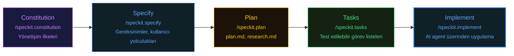

# SpecKit - GitHub's Gated Process

GitHub Stars: 75.9k | License: MIT | Latest: v0.1.4 (Feb 2026) | [GitHub](https://github.com/speckit/speckit) | [Blog](https://github.blog/speckit)

SpecKit, GitHub'ın spec-driven development alanına resmi girişidir ve yıldız sayısı (bu karşılaştırmadaki en yüksek) GitHub'ın devasa platform erişimini yansıtır.

Temel felsefe belirsizliğe yer bırakmadan ifade edilir: **"Specification'lar koda hizmet etmez; kod specification'lara hizmet eder."** SpecKit, specification'ı implementation'ı yönlendiren bir kılavuz olarak değil, implementation'ın türetildiği otoriter kaynak olarak ele alır.

## Gated Process

SpecKit, explicit checkpoint'ler ile katı, sıralı bir workflow dayatır. Mevcut faz doğrulanmadan bir sonraki faza geçemezsiniz.

**Constitution** (`/speckit.constitution`): Proje için yönetişim ilkelerini belirler.

**Specify** (`/speckit.specify`): Ne inşa edileceğini tanımlar, yapılandırılmış gereksinimler ve kullanıcı yolculukları üretir.

**Plan** (`/speckit.plan`): Teknik implementation stratejileri oluşturur; plan.md, research.md ve ilgili artifact'ları üretir.

**Tasks** (`/speckit.tasks`): Plandan eyleme dönüştürülebilir, test edilebilir görev listeleri üretir.

**Implement** (`/speckit.implement`): Görevleri bağlı AI agent üzerinden çalıştırır.

Opsiyonel fazlar arasında **Clarify** (yetersiz tanımlanmış alanlar için) ve **Analyze** (artifact'lar arası tutarlılık kontrolü için `/speckit.analyze`) bulunur.

## Güçlü Yanları

Gated process, AI coding'deki en yaygın başarısızlık modunu önler: gereksinimler netleşmeden implementation'a koşmak. Framework, canlı dokümantasyon olarak hizmet eden zengin bir artifact seti üretir (spec.md, plan.md, research.md, data-model.md, contracts, quickstart guide'lar).

20+ AI coding agent desteğiyle (Copilot, Claude Code, Cursor, Gemini CLI, Windsurf dahil) SpecKit, mevcut en platform-agnostik seçenektir.

## Zayıf Yanları

Seremoni oldukça ağırdır. Bağımsız değerlendirmeler, feature başına artifact üretimi ve review için **1-3+ saat** raporlamaktadır. Küçük değişiklikler için -- bir config flag eklemek veya bir validation bug'ı düzeltmek gibi -- tam specify-plan-task-implement döngüsünden geçmek, raptiyeye balyozla vurmak gibidir.

Spec'ler statiktir; implementation sırasında otomatik güncellenmez, bu nedenle uzun projelerde **dokümantasyon sapması** gerçek bir risktir.

SpecKit ayrıca **multi-agent orkestrasyon** eksikliğine sahiptir. `/speckit.implement` komutu bağlı olan tek AI agent'a delege eder, ancak paralellik veya agent izolasyonu yönetmez.

## Pratikte Trade-Off

SpecKit, fazla specification'ın maliyetinin her zaman eksik specification'ın maliyetinden düşük olduğuna bahse girer. Belirsiz gereksinimlere sahip greenfield projelerde bu bahis genellikle kazanır. Olgun kod tabanlarına yapılan iyi anlaşılmış değişikliklerde ise specification overhead'i saf sürtünmeye dönüşür.

Feature başına 1-3 saatlik yatırım, yeniden çalışmaya karşı bir sigortadır; bu sigortanın değip değmeyeceği, ilk seferde implementation'ı yanlış yapmanın maliyetine bağlıdır.

## Ne Zaman Kullanmalı

* Belirsiz gereksinimleri olan greenfield projeler
* Compliance-heavy ortamlar (spec onayı zorunlu)
* Spec-driven geliştirme kültürü olan takımlar
* Çoklu AI agent'lar arası geçiş yapan takımlar (platform-agnostik)

## Ne Zaman Gereksiz

* Küçük bug fix'ler veya config değişiklikleri
* İyi anlaşılmış, rutin değişiklikler
* Hızlı iterasyon gerektiren prototipler
* Paralel agent çalıştırma ihtiyacı olan projeler
