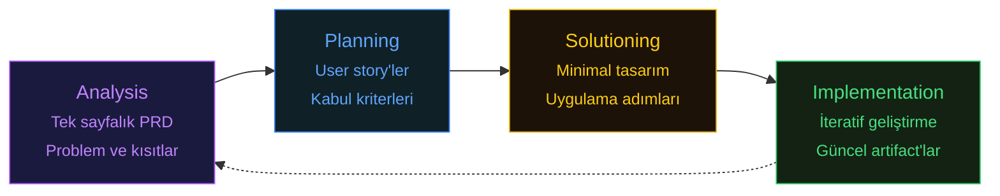

# BMAD Method - AI-Driven Agile Development Framework

GitHub Stars: 40.2k | License: MIT | Latest: v6.0.4 (March 2026) | [GitHub](https://github.com/bmad-code-org/BMAD-METHOD) | [Docs](https://docs.bmad-method.org/)

BMAD (Breakthrough Method for Agile AI-Driven Development), bu karşılaştırmadaki diğer framework'ler birer güç aracı ise, BMAD tam donanımlı bir makine atölyesidir.

## Ne Yapar?

BMAD, 12+ özelleştirilmiş AI persona kullanarak tam bir agile geliştirme takımı simüle eder. Her persona, uzmanlık, sorumluluklar, kısıtlamalar ve beklenen çıktıları belirleyen bir "Agent-as-Code" Markdown dosyası olarak tanımlanır. AI'dan sadece kod yazmasını istemezsiniz. Product Manager persona'sından PRD yazmasını, Architect persona'sından sistemi tasarlamasını, Developer persona'sından implement etmesini ve Scrum Master persona'sından backlog'u önceliklendirmesini istersiniz.

Metodoloji dört fazlı bir döngü izler:

**Analysis** problemi ve kısıtları yakalayan tek sayfalık bir PRD üretir. **Planning** PRD'yi kabul kriterleri olan user story'lere böler. **Solutioning**'de Architect minimal tasarım oluşturur, Developer uygulama adımlarını önerir. **Implementation** küçük story'ler üzerinden iteratif ilerler ve her adımda artifact'lar güncellenir.

BMAD'i farklı kılan **dokümantasyon merkezli felsefesidir**. BMAD'de kaynak kod tek doğruluk kaynağı değildir. PRD, mimari çizimler ve user story'ler kodun yanında yaşayan birinci sınıf artifact'lardır. Her AI geçişi artımsal ve doğrulanabilirdir, çünkü geçici sohbet geçmişinden değil bu kalıcı dokümanlardan çalışır.

## Agent Rolleri

| Agent                     | Rol              | Ne Yapar                                                   |
| ------------------------- | ---------------- | ---------------------------------------------------------- |
| **BMad Master**           | Orkestratör      | Diğer agent'ları koordine eder, workflow yönetir           |
| **Business Analyst**      | İş Analisti      | Gereksinim toplama, kullanıcı hikayeleri, kabul kriterleri |
| **Product Manager**       | Ürün Yöneticisi  | Önceliklendirme, roadmap, feature scope belirleme          |
| **System Architect**      | Mimar            | Teknik tasarım, mimari kararlar, teknoloji seçimi          |
| **UX Designer**           | Tasarımcı        | Kullanıcı akışları, wireframe, UI pattern'lar              |
| **Scrum Master**          | Süreç Yöneticisi | Sprint planlama, görev bölümü, ilerleme takibi             |
| **Developer**             | Geliştirici      | Implementation, code review, refactoring                   |
| **Builder**               | İnşacı           | CI/CD, altyapı, deployment                                 |
| **Creative Intelligence** | Yaratıcı         | Alternatif yaklaşımlar, problem çözme                      |

## Party Mode ve Scale-Adaptive Intelligence

BMAD'in "Party Mode"u birden fazla persona'nın tek bir session içinde işbirliği yapmasını sağlar. Ayrı agent konfigürasyonları arasında geçiş yapmak yerine, Developer ile konuşma ortasında Architect'i tasarım review'i için çağırabilir veya Product Manager kabul kriterlerini rafine ederken Scrum Master'ın story'leri yeniden önceliklendirmesini sağlayabilirsiniz.

Framework ayrıca proje karmaşıklığına göre dokümantasyon titizliğini ayarlayan **scale-adaptive intelligence** özelliğine sahiptir. Bir bug fix hafif bir analiz alır. Yeni bir microservice ise mimari diyagramlar, API kontratlar ve deployment spesifikasyonları ile tam muamele görür. Bu, framework'ün enterprise düzeyi seremonisini bunu hak etmeyen görevlere uygulamasını önler.

## Güçlü Yanları

BMAD izlenebilirlikte öne çıkar. Her kararın bir kaydı vardır. Her gereksinim bir user story'ye, user story bir implementation görevine, görev bir teste eşlenir. Denetim izleri, uyumluluk dokümantasyonu veya takımlar arası devir teslim gerektiren organizasyonlar için BMAD bu gereksinimleri doğal olarak karşılayan artifact'lar üretir.

34+ temel workflow, beyin fırtınalarından deployment'a kadar tam yazılım geliştirme yaşam döngüsünü kapsar. 1,468 commit ve 123 katılımcı, olgun ve aktif olarak geliştirilen bir ekosisteme işaret eder.

## Zayıf Yanları

Öğrenme eğrisi diktir. BMAD'in persona sistemi, workflow kütüphanesi ve artifact konvansiyonları özümsenmesi zaman alır. Yan proje geliştiren yalnız bir geliştirici için, simüle edilmiş altı kişilik bir agile takımı çalıştırmanın overhead'i gereksizdir. Üç maddelik bir backlog'u önceliklendirmek için Scrum Master persona'sına ihtiyacınız yoktur.

Dosya tabanlı koordinasyon modeli, hızlı tasarım değişiklikleri gerektiğinde iterasyonu yavaşlatabilir. PRD'yi, sonra mimari çizimi, sonra user story'leri, sonra implementation görevlerini güncellemek, geri bildirim döngüsüne sürtünme ekleyen bir doküman güncelleme kaskadı oluşturur.

> **Dikkat**
>Eğer tam BMAD framework özellikle analiz yetkinliklerini kullandığınızda çok ciddi token tüketimi yapıyor.  Sıfırdan başladığım bir projede tüm BMAD method skill lerini kullanarak uygulamanın geliştirme aşamalarına kadar süreçleri işlettiğimde hem Claude Code hem Antigravity'de günlük limitlere takıldım. Buna dikkat etmeniz gerekiyor.

## Pratikte Trade-Off

BMAD'in temel trade-off'u **kapsamlılık vs çevik hareket**. En kapsamlı dokümantasyonu ve en net denetim izini elde edersiniz, ama kurulum süresi ve kaskad güncellemeler ile bedelini ödersiniz. Uyumluluk artifact'larına gerçekten ihtiyaç duyan takımlar (sağlık, finans, kamu ihaleleri) overhead'i haklı bulacaktır. Cuma'ya kadar bir feature göndermesi gereken takımlar ise bunaltıcı bulacaktır. Scale-adaptive intelligence yardımcı olur, ama ancak framework'ün bir görevin "hafif muamele için yeterince basit" olduğunu doğru değerlendirmesine güvenirseniz.

## Ne Zaman Kullanmalı

* Sıfırdan yeni proje başlatırken (greenfield)
* Karmaşık, çok modüllü enterprise uygulamalar
* Yapılandırılmış agile süreç gerektiğinde
* Dokümantasyon-first yaklaşım istediğinizde
* Denetim izleri ve uyumluluk gerektiren sektörler (sağlık, finans, kamu)

## Ne Zaman Gereksiz

* Basit bug fix veya küçük feature
* Tek dosya düzenleme
* Mevcut projeye hızlı ekleme
* Solo geliştirici, küçük kapsam

> **Kaynaklar:**
>
> * [BMAD Method Docs](https://docs.bmad-method.org/)
> * [GitHub - BMAD-METHOD](https://github.com/bmad-code-org/BMAD-METHOD)
> * [BMAD for Claude Code](https://github.com/24601/BMAD-AT-CLAUDE)
> * [BMAD Skills Plugin](https://github.com/aj-geddes/claude-code-bmad-skills)

